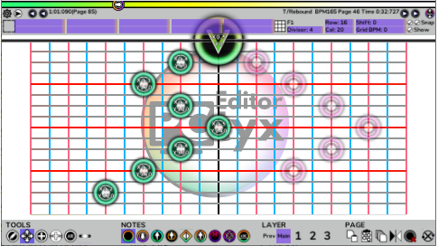
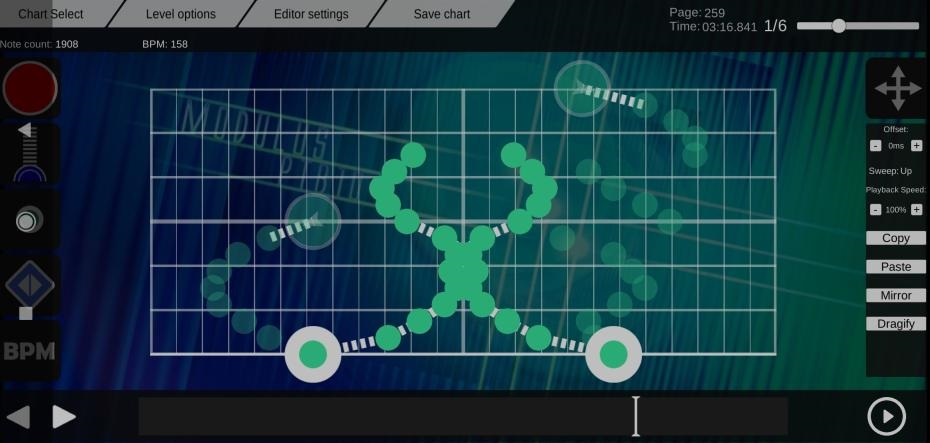

# Chart editors

Chart editor is a tool that helps you chart and finish quickly. A chart editor often provides edit and preview mode with its WYSIWYG user interface (means you don't need to remember parameters).

## PCtyx

{.side-img}

- Platform: Windows, macOS, Linux

- Supported audio formats: WAV, OGG, and FLAC

- Additional features:
  - Cytoid level.json generator
  - Supports some note events (exporting only, v210 or higher)

- Pros:
  - Cross-platform
  - Friendly UI
  - High performance

- Cons:
  - Slow file reading and exporting
  - Cannot read C2 chart format properly
  - Auto-saving is not supported

## Cylheim

{.side-img}

- Platform: Windows

- Supported audio formats: WAV and OGG

- Additional features:
  - level.json and .cytoidlevel generator
  - Custom note hit sound
  - Page events

- Pros:
  - Fast file reading
  - Supports auto-saving
  - Friendly UI

- Cons:
  - Windows-only
  - Bad performance on old devices
  - Some features need the build-in converter to play as intended in Cytoid

## Cytoid Chart Editor

{.side-img}

- Platform: Android/iOS/PC

- Supported audio formats: WAV and OGG

- Additional features: Unknown

- Pros and cons: Unknown

## Cy2Unity

{.side-img}

- Platform: Windows

- Supported audio formats: WAV and OGG

- Additional features:
  - Batch editing

- Pros: Unknown

- Cons:
  
  - Windows-only
  - Laggy and buggy when your chart has more than 1000 notes

## Cyunity

- Platform: Windows (x86)

- Supported audio formats: WAV and OGG

- Additional features: Waveform displaying

- Pros:
  - Waveform displaying
  - Quite friendly UI

- Cons:
  - Lack of features in editing mode
