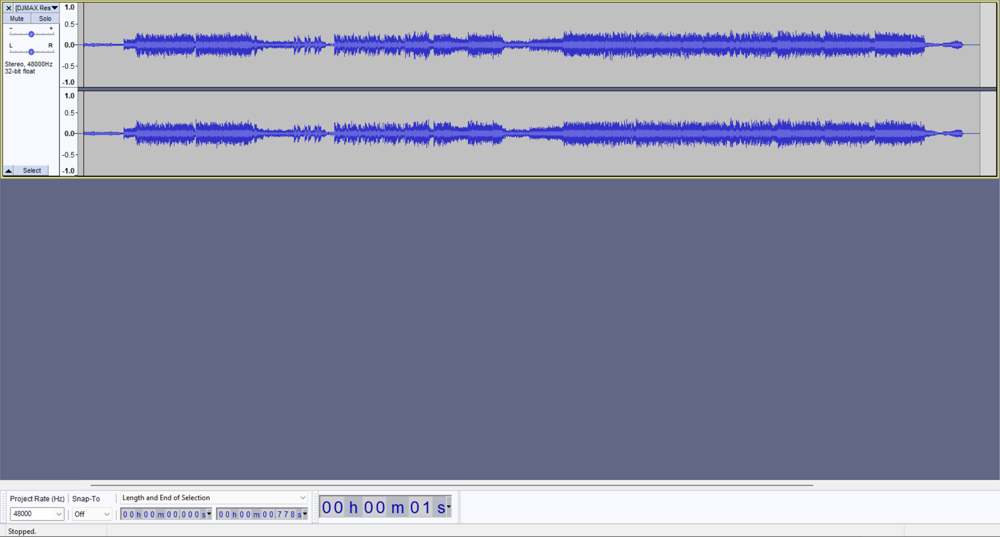
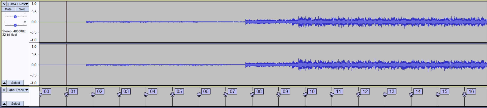
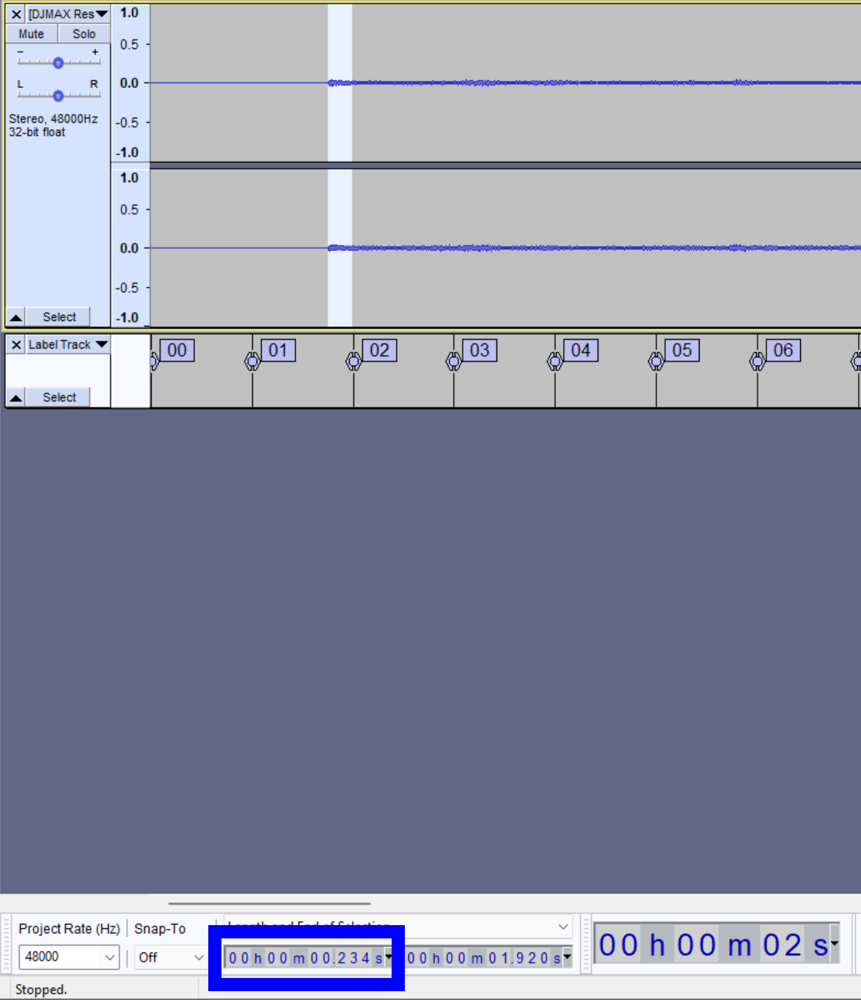
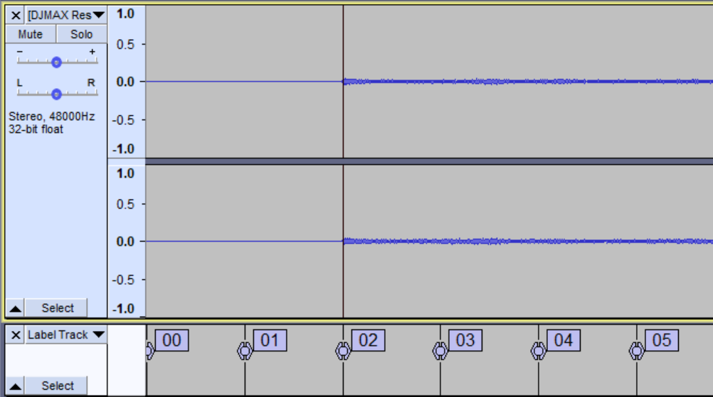

# Audio editing

Cytoid supports the `music_offset` parameter. However, you still should set it to "0" while charting so we can maximize the compatibility with chart editors. Moreover, if your song starts before 0.9 seconds, this might be a big problem for your chart. That's why you should always edit the audio file(s) before charting.

## You will need

- An audio editor - we will use [Audacity](https://www.audacityteam.org/) in this article.
- The audio file of the song you want to chart.

## Editing your audio file(s)

### Importing the file into Audacity

You can go to File --> Import --> Audio or use the "drag and drop" method.

### Editing your audio file(s)

::: tip INFORMATION
We will use "Marry me, Nightmare" by t+pazolite as an example for this article.
:::

Now, look at the waveform.

You can see that the music starts at around 0.778 seconds, that's below 0.9 seconds, we need to fix it.

Click on the start of the audio and go to generate --> Silence, type 0.9, and click "OK".

Our result will look like this:

Next, double-click or **Ctrl + A** on your keyboard and go to Tools --> Regular Interval Labels..., you can see this dialog:

{.side-img}

Now set:

- "Create labels based on:" to *Label Interval*
- "Label interval (seconds):" to ${120 \div BPM}$ (in this example, it starts with 250 BPM, so ${120 \div 250} = 0.48$)
- "Adjust label interval to fit length:" to *No*
- "Begining numbering from:" to *0*

Here is our configuration for this example:

Click OK, and this is our result.

As you can see, it starts in the middle between the label *2* and *4*. To zero the offset, you will have to make sure that the music begins on the label.
::: tip NOTE

We recommend you syncing the labels that are an even number because of how syncing works with speed changes

:::

There are two approaches, either edit the music to start at Label 2 or start at 4. So either delete some silence (approach 1) or generate more silence (approach 2). This is dependent on your existing chart.

To do approach 1, simply left-click and drag from where the music starts until it selects to label 2, then press **Delete**.

And for the second approach, first, make sure you have set selection to *Length and End of Selection*, then zoom in to label 0 and label 1, and drag from the start of the music to label 4.

{.side-img}

The left bar will show the duration needed to generate silence. This happens to be 0.237. Note it.

Deselect your selection, press Home, go to Generate --> Silence, and enter the value shown earlier.

Now the music starts at Label 4. And you can test play this with scanline shift/offset 0. If the scanline rebounds in line with the beat, you've done right.

::: warning
If your song has fade-in before it starts, always sync the label with the first beat and not the fade-in.
:::

Congratulations! You've learned how to edit an audio file. Now, you should try editing your audio file and start charting!
