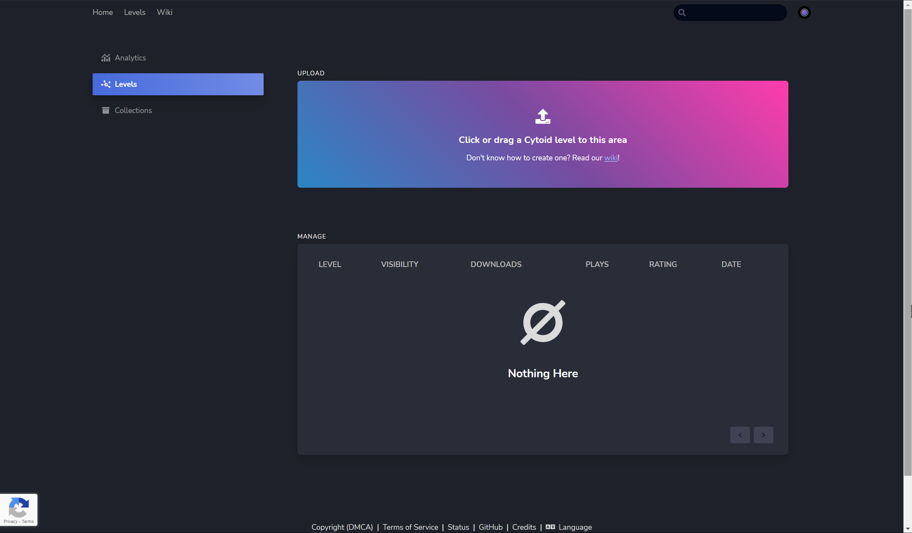
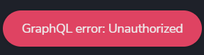
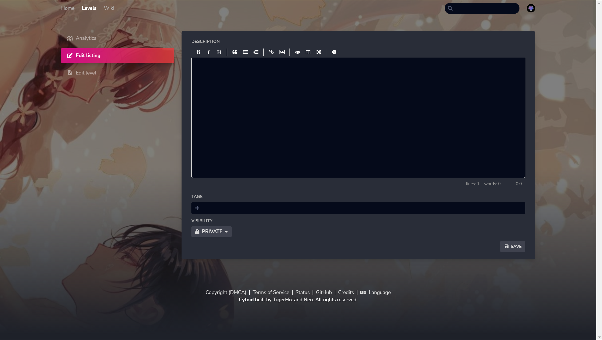

# Uploading your level

You seem very proud of your chart! Now we'll learn how to upload and let people play it!

You will need to check these to proceed:

- A Cytoid ID (sign up [here](https://cytoid.io/session/signup) if you don't have one)
- A `.cytoidlevel` file (read [this article](../cytoid/packing.md) to learn how to make one)

After checking, you can log in to [CytoidIO](https://cytoid.io/session/login) and go to the [Studio](https://cytoid.io/studio/levels). You will see something like this:

Here, you can click the *Click or drag a Cytoid level to this area* button and select the Cytoid level you want to upload or click and drag the `.cytoidlevel` file to that area.

## Upload errors

If you have errors while uploading, here’s a quick FAQ with the errors:

### ID error

{.side-img}

It means your ID is in the wrong format. Remember that ID **cannot** have capitals or spaces, and you **need** to add a `.`, `_` or `-` in between after the first word.

### File not found error

{.side-img}

It could mean:

- You haven't zipped (more than) one of the file(s) specified in the `level.json`
- You zipped the folder
- The file path(s) in the `level.json` file is (are) wrong

Check all three of them before uploading again

::: danger

Capitals or not will also mess up the problem. Make sure the path's names are exactly what the files are named. This is also why we recommend you only use lower-case letters for the file name. Also, **do not** use special characters.

CytoidIO cannot detect if you also have the necessary resources for your **storyboard**. And because just missing an image will make the storyboard unplayable, **you really should double-check when you're uploading a storyboard chart that contains images (sprites)**

:::

### Unauthorized error

{.side-img}

It means your login time has expired. You can refresh the page, log in, and try again.

### Missing required field(s) error

{.side-img}

It means you forgot to add the required field(s). You may have to check and fill in the required field(s) in the `level.json` file, then zip again.

## After uploading

If your chart(s) has uploaded successfully, the website will redirect to this page:

In here you have:

**Analytics**: does nothing as of now.

**Edit listing**: add descriptions, add tags, and set the visibility of a chart.

**Edit level**: upload a new version of a chart if you need to and preview level information.

::: warning NOTICE

Currently, Cytoid cannot show descriptions in-game.

:::

You can write anything in the description and tags or don’t even add one as long as it's following the [rules](rules.md).

Finally, click the *PRIVATE* button, then the *Public* button, and click *SAVE* after finishing. Now, people can download your level on CytoidIO and Cytoid’s build-in chart downloader!

::: tip Information

We used an art drew by [鵜飼沙樹](https://www.pixiv.net/users/48456) as an example background image for this article. Here's the link to the [art](https://www.pixiv.net/artworks/92258191).

:::
