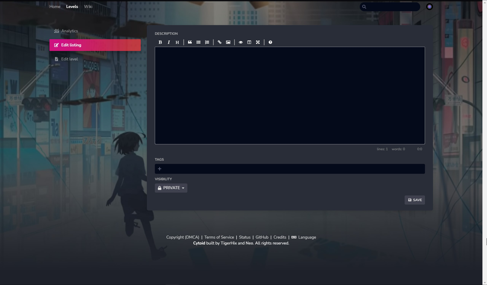

# Upload your level

You’re very satisfied with your chart ! Now how do I upload it to let the world play it ?

It’s very simple, all you need beforehand are:
1.	A Cytoid ID
2.	A ```.cytoidlevel``` file

::: tip Links

If you don’t have a Cytoid ID,
Sign up [here](https://cytoid.io/session/signup).


If you don’t have a ```.cytoidlevel``` file,
read [this article](../cytoid/packing.md) to learn how to make one.

:::

After these you can login in [cytoid.io](https://cytoid.io/session/login) and go to [https://cytoid.io/studio/levels](https://cytoid.io/studio/levels).<br>
Here you will see something like this:
 
 

In here you can click the *Click or drag a Cytoid level to this area* and select the cytoidlevel you want to upload or just drag the ```.cytoidlevel``` file to that area.

## Upload errors

 If you have errors while uploading,<br>
here’s a quick FAQ with upload errors:

If the error is this:
 
  

This means your ID is in the wrong format, <br>
remember that ID **cannot** have capitals and spaces, and you **need** to add a ```.```, ```_``` or ```-``` in between after the first word.

If the error is this:
 
  

This could mean:
1.	You didn’t zip (more then) one of the file(s) that was specified in the level.json
2.	You zipped the folder and not the files
3.	You have the level.json’s path(s) wrong

Check all three of them before uploading again

:::warning WARNING :

Capitals or not will also mess up the paths, make sure they are exactly what the files are named.
This is also why we recommend you to only use lower-case letters as files name.
Also, **do not** use special letters ( Japanese, Unicode symbols etc.).

:::

::: warning WARNING:

cytoid.io cannot detect if you also have the necessary resources for your **Storyboard**,<br>
and because just missing an image will *broke* the whole storyboard, **you really should double check when you're uploading a Storyboard chart that have sprites**

:::

If the error is this:

 
 
This means your login time has expired, please reflash the page, login and try again.<br>
~~unless it’s a server problem, you should be able to upload charts again after this.~~

## After upload

If your chart uploaded successfully, you will be moved to this page:
 
  

In here you have:

**Analytics** : does nothing as of now.<br>
**Edit listing** : add description, add tags and set the visibility of a chart.<br>
**Edit level** : upload a new version of a chart if you need to, the bottom does nothing as of now.

:::tip Notice:

As of Cytoid 2.0.2, the game can’t show the description in-game

:::

You can write anything in the description or don’t even add one as long as it’s following the rules (no NSFW, racism, etc.),

Same goes to tags but you should at least add the artist and your charter name in the tags

Finally, when everything is finished, you can click on the *PRIVATE* button and click on the *Public* button, click *SAVE* and your chart is now downloadable on cytoid.io and Cytoid’s build-in chart downloader!

::: tip Information

We used a scene of a MV illustrated by [banishment](https://www.pixiv.net/en/users/23223750) as an example image for this article. Here's the link to the [music video](
https://youtu.be/Gl8sikQ807E).

:::