# Charting and You

## Introduction

This is a guideline for charting, **not the absolute way of charting.** You can chart however you want. Hell make everything drag notes if you want to, the one that judges your chart will be the players, not other charters. With that said, this guide will point out **what makes a chart not ugly** and thus will not receive flames of judgment, and also (hopefully) supportive criticism from players and charters alike.

## Things you need to know first

Being a charter doesn’t mean you have to be good at playing the game. You only need to understand how the chart works. You can chart charts above your skill level and ask good players in community to play your charts for you and gain feedback from them. In fact, being “not good” in playing has its own advantage when charting, so don’t be down if someone Million Mastered your chart when you yourself can only score 900k when you play it yourself (in fact if someone can Million Master your chart, it means you have done a chart well).

Charts comes in many forms and shapes. So many forms and shapes in fact that they cannot be generalized in a convenient manner. Every chart is its own art, and should be appreciated in its own way. What makes a chart good for you is not the same for everybody else, so keep an open mind. With that said, there is a baseline that everybody needs to follow.

## Chart quality measurement

### Playable

Charts at the very least must be playable. By playable, it means the chart has no anti-fun mechanics in it. Charts that have anti-fun means it’s ugly, not as in bad quality, but just sheer ugliness. The anti-fun mechanic will be explained below. Troll-charts are excluded.

### Qualities

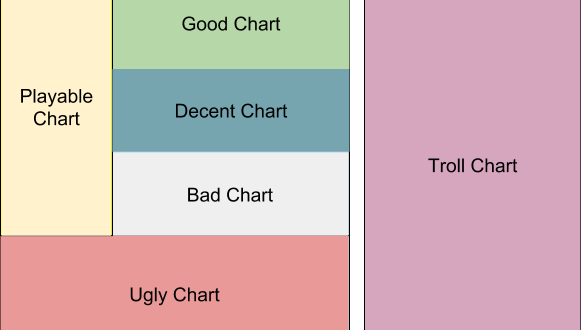

Ugly charts like stated earlier are charts that have anti-fun factor. Bad charts are charts mainly filled with badly-placed notes. Decent charts are charts that are not in Bad category. Good charts are decided by the players (and thus the community), now typically through the rating system on cytoid.io. Troll charts play by different rules since they are more for appreciation rather than for playing.
> Your requirement as a charter is to make sure your chart is not an ugly chart.

Bad charts mean you just need to improve more. but an ugly chart is intolerable. In the end, **your job as a charter is to make a decent chart. A good chart is an award you get after the community deems it so.** (but you should always aim for a good chart, because it’s fun for everybody).

## Preventing your chart from becoming an ugly chart

You will need to know what the meaning of **Anti-fun** is first. Anti-fun means the player is forced to miss not because of their lack of skills, but because of the chart design. Because of Anti-fun, your chart can be considered ugly.

There are two things that will make people declare your chart is ugly no matter what, also known as **the Anti-fun factor**:

1. Overlapping notes.

2. Notes blocked by hand.

### Overlapping Notes

By design (and through imitation of its inspiration, Cytus), Cytoid uses the same screen for notes that goes up and goes down. It will cause problems if you are not aware the consequences of such thing.

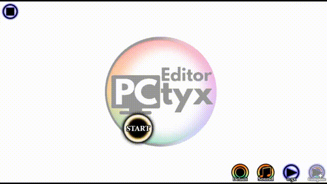

Can you picture when you are in a trance playing a song with combos without misses and suddenly ruined because of something like this? Very annoying right?

Players are forced to miss not because of their lack of skills, but by level design. Of course they will rage on because of such reason.

#### Fix

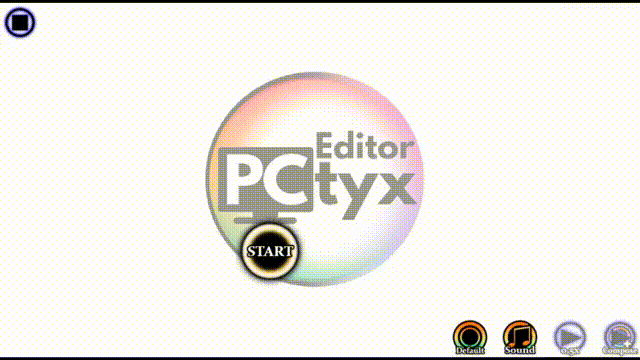

You can fix such problems by simply moving the problematic note away

#### Prevention

To prevent this from happening, PCTyx has this feature:

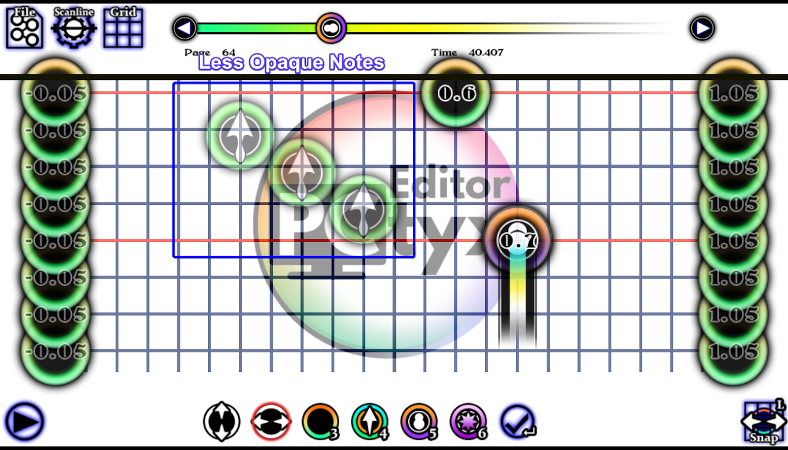

These transparent notes are from previous pages. Do not put notes in places that are completely covered by them.

Same goes to Cylheim:

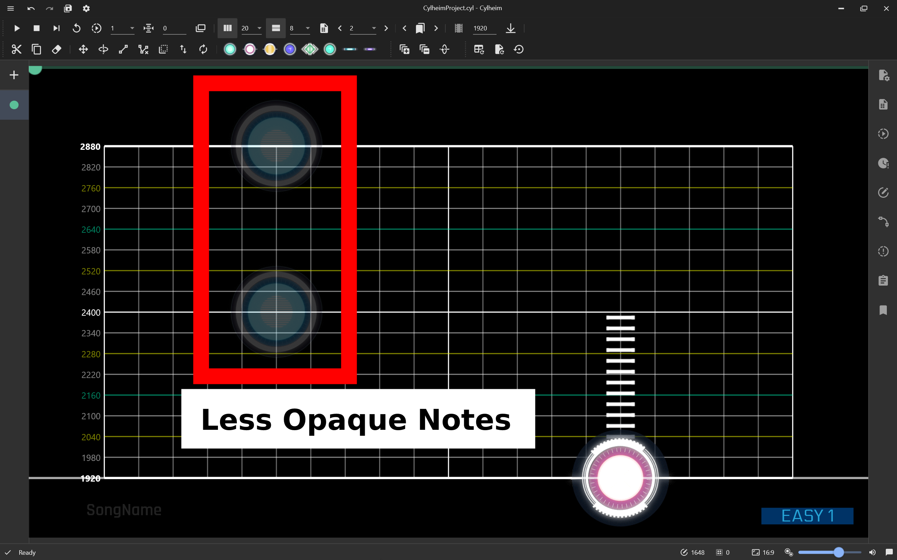

Same do Cytunity somewhat, less prominent in autoplay mode, but completely missing when in editing mode.

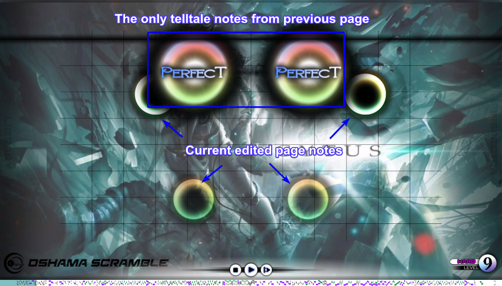

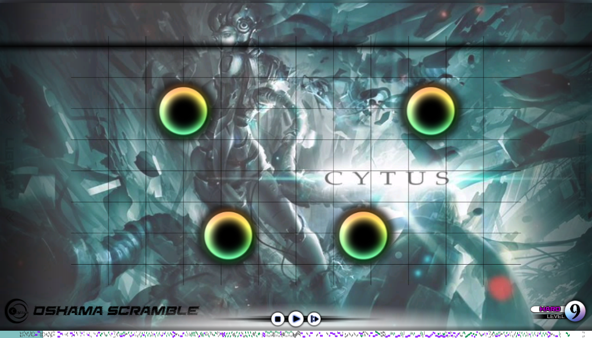

There are no information whatsoever from previous page (in Edit Mode), making you as a charter prone to mistakes. Keep this in mind when charting (This is also probably the main reason why new charters often have overlapping notes in their chart). 

### Tolerable overlaps

There is no definite rule set, but you can somewhat overlap some parts of your notes, especially if your song has high bpm and have to keep the notes close between pages.

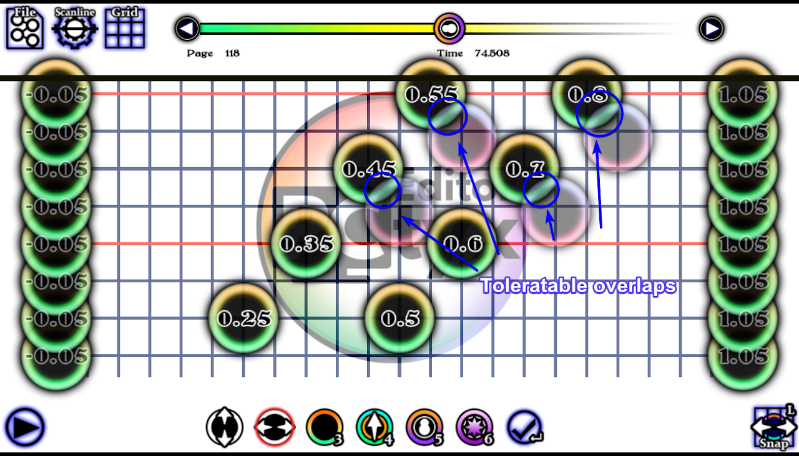

We think for tablets, the maximum overlap is about ¼ of a note, while for phones is about ⅙.

> The higher the BPM, the less tolerable an overlap can be. The closer you are to the middle of the page, the more tolerable the overlap can be.

### Notes blocked by hand

Phones and tablets have different screen size. Tablets are bigger and thus less screen is blocked by the hand. Keep this in mind when you target your chart for phones instead of tablets. Also, since all charts targeted for phones can be used by tablets (but not the other way), the example below only shows an example of chart optimized for phones.

On top of overlapping notes, you also have to worry about the player’s hand blocking their view on notes. This is very prominent when you chart to the edge of screen. Here’s a preview image of where to not chart when having situation like this.

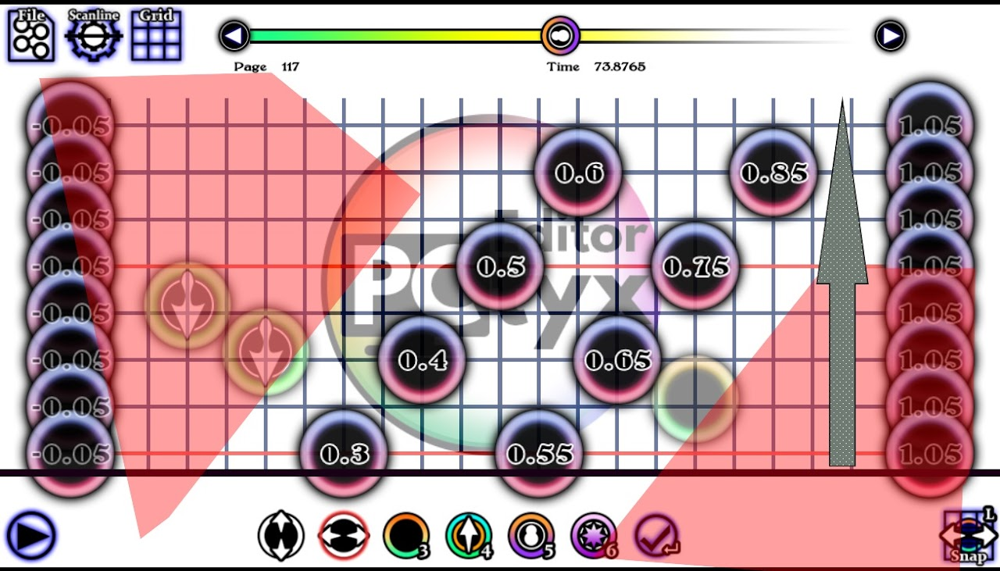

The arrow on the right gives the direction of current page, which is going up from bottom. The **red areas** are covered by your hand the moment the **last two notes on top are reached by the scanner.**

On the picture, it shows page 117, then on page 118 **do not chart on those red shaded areas.**

Then on Page 118, it goes like this:

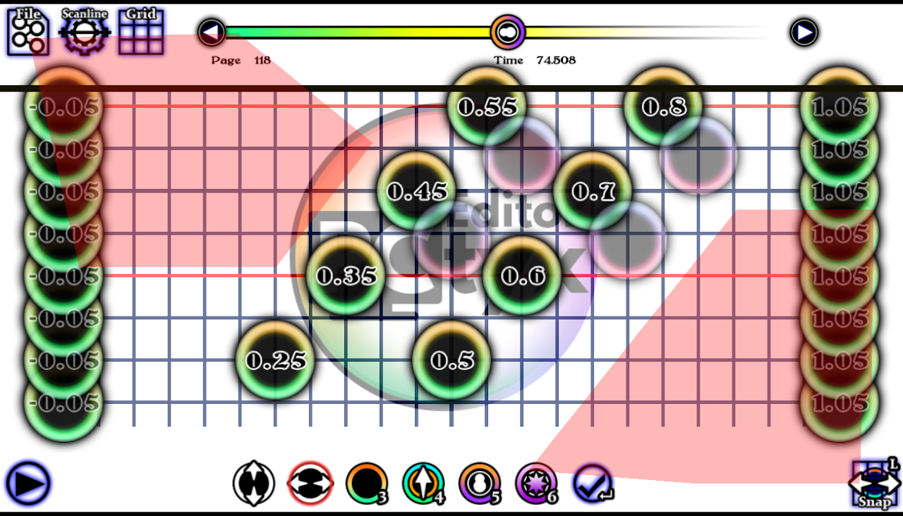

Why does the red area on the left only half-sized? **Because the most relevant part are only first half of a page**, and the notes are moved from top right to bottom left.

If we go to the next page, an example of would be like this:

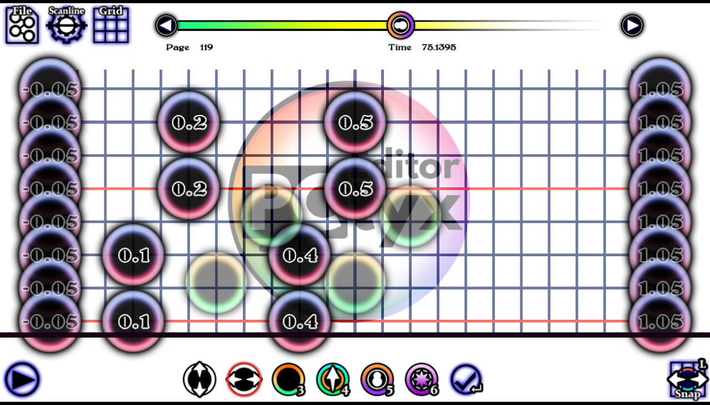

If we combine all three pages, it becomes like this:

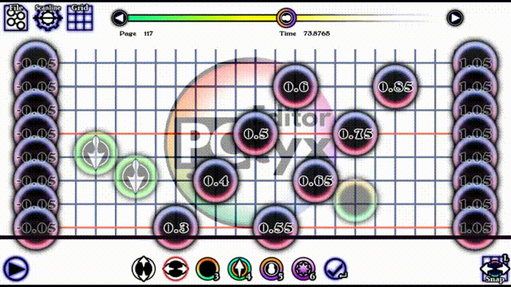