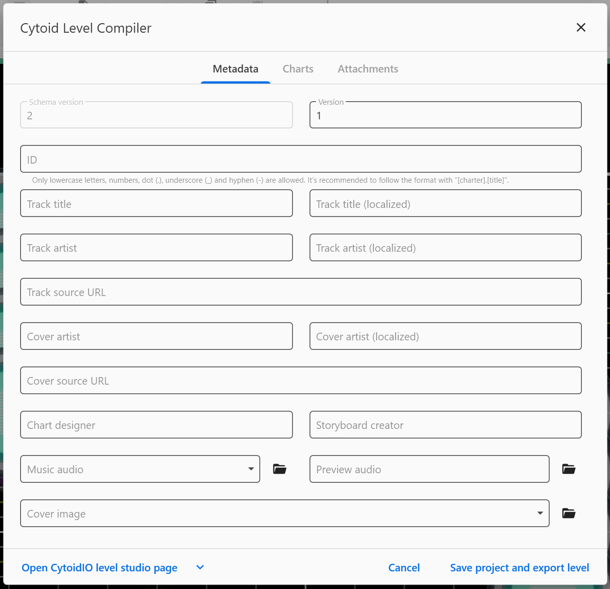
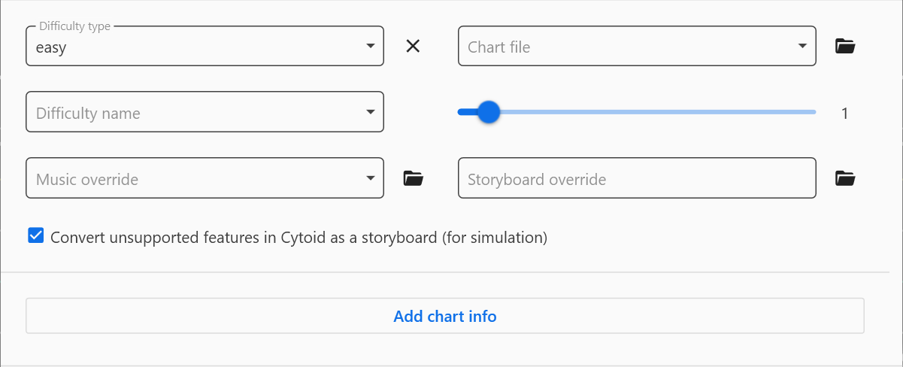
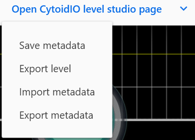

# Building a level.json file

A level.json is a metadata file that stores crucial data of your levels. (e.g., the song’s title, the path to the background image, etc.)  
Here are a few parameters that you might need to use in the level.json file before playing on Cytoid and sharing on the IO (:star:).

## Parameters

### Schema version, level version, and level ID

`schema_version` :star:
: The level schema version.
: Example:

```json
"schema_version": 2
```

::: warning NOTICE!
To upload to CytoidIO, its value **must** be: `2`.
:::

`version` :star:
: Your level version, start with `1`. If you changed something in your chart, go up by 1.
: Example:

```json
"version": 2
```

`id` :star:
: Your level's unique ID. Its value **must** be a string and **lowercased**.
: Example:

```json
"id": "abcde.testsong"
```

::: warning NOTICE!
We recommend you use your chart's unique ID as: `<your_name>.<song_name>`.
:::

### Basic level information

#### Song title

`title` :star:
: The song title in its original language.
: Its value **must** be a string.
: Example: 

```json
"title": "You are the Miserable"
```

`title_localized`
: The localized song title.
: You only need to use this if the song title has an alternative title or is not in English.

#### Artist information

`artist` :star:
: The artist's name.
: Its value **must** be a string.
: Example:

```json
"artist": "t+pazolite"
```

::: warning NOTICE!
With tracks from other video games, be sure to credit the game title if it doesn't give credit to the artist.
:::

`artist_localized`
: The artist's localized name.
: You only need to use this if the artist's name has is not in English.

`artist_source` :star:
: A **URL link** to the source of the music, artist's website (owner of the song), or even the game's website (that game **must** have the song file you charted).
: Example:

```json
"artist_source": "http://mutra.c-h-s.me/"
```

#### Illustrator information

`illustrator` :star:
: The illustrator's name.
: Its value **must** be a string.
: Example:

```json
"illustrator": "白祈QSR"
```

::: warning NOTICE!
Do not use "unknown" or something like that as the illustrator!
:::

`illustrator_source` :star:
: A **URL link** to the source of the background image, artist's website (owner of the background image), or even the game's website (that game **must** have the background image you used).
: Example:

```json
"illustrator_source": "https://www.pixiv.net/en/artworks/69136806"
```

#### Charter and storyboarder

`charter` :star:
: The charter's name.
: Its value **must** be a string.
: Eample:

```json
"charter": "abcde"
```

`storyboarder`
: The storyboarder's name.
: Its value **must** be a string, and you only need to use this if your level has a storyboard.  
: E.g.:

```json
"storyboarder": "fghij"
```

### File paths

#### Path to music, music preview, and background file

`music` :star:
: Start with a curly bracket: `{`.
: - **path**: The path to your music file. Its value **must** be a string.
: Use another curly bracket: `}` to mark as the end of this parameter.
: Example:

```json
"music":
{
  "path": "music.ogg"
}
```

`music_preview` :star:
: Start with a curly bracket: `{`.
: - **path**: The path to your music file. Its value **must** be a string.
: Use another curly bracket: `}` to mark as the end of this parameter.
: Example:

```json
"music_preview":
{
  "path": "preview.ogg"
}
```

`background` :star:
: Start with a curly bracket: `{`.
: - **path**: The path to your image file, its value **must** be a string.
: Use another curly bracket: `}` to mark the end of this parameter.

```json
"background":
{
  "path": "background.jpg"
}
```

#### Creating level difficulty(-ies)

To create level difficulty(-ies), you need to use the **charts** parameter.

First, start with a square bracket: `[`. Then, initialize a new difficulty with a curly bracket: `{`. Here you can use the following parameters:

`type` :star:
: The difficulty type of the chart. Its value **must** be a string and classified as one of three here: `easy`, `hard`, and `extreme`.
: E.g.: `"type": "extreme"`.

`name`
: The name of the current difficulty, its value **must** be a string.
: E.g.: `"name": "Extra"`.

`difficulty` :star:
: The difficulty of the chart, its value **must** be an integer and rated from 0 to 16.
: E.g.: `"difficulty": 13`.

::: tip NOTICE!
Use `0` if the chart is a troll chart. `16` or higher will display as *15+* on Cytoid.
:::

`path` :star:
: The path to your chart in the current difficulty.
: E.g.: `"path": "chart.easy.txt"`.

`music_override`
: Use this in-between two or more difficulties if they use a different song file.
: Start with a curly bracket: `{`.
: - **path**: The path to your music file, its value **must** be a string. E.g.: `"path": "music2.ogg"`.
: Use another curly bracket: `}` to mark as the end of this value.

`storyboard`
: Use this in-between two or more difficulties if they use a different storyboard.
: Start with a curly bracket: `{`.
: - **path**: The path to your storyboard file, its value **must** be a string. E.g.:`"path": "sb.hard.json"`.
: Use another curly bracket: `}` to mark as the end of this value.

Finally, use another curly bracket: `}` to mark the end of the current difficulty. If you want to create a new difficulty, use curly brackets to initialize it and repeat.

Once finished, use another square bracket: `]` to mark the end of `charts`.

Here is an example (with 1 difficulty):

```json
"charts":
[
  {
    "type": "extreme",
    "name": "Extra",
    "difficulty": 13,
    "path": "chart.ex.txt"
  }
]
```

## Resources

### level.json template

You may copy this template and fill in the blank values with information relevant to your chart. **Remember, if a parameter requires a string value, type inside `""`; if a  is an integer, type next to `:`.**

```json
{
  "schema_version": 2,
  "version": ,

  "id": "",

  "title": "",
  "title_localized": "",

  "artist": "",
  "artist_localized": "",
  "artist_source": "",

  "illustrator": "",
  "illustrator_source": "",

  "charter": "",
  "storyboarder": "",

  "music": {
    "path": ""
  },
  "music_preview": {
    "path": ""
  },
  "background": {
    "path": ""
  },

  "charts": [
    {
      "type": "",
      "name": "",
      "difficulty": ,      
      "path": "",
      "music_override":
      {
        "path": ""
      },
      "storyboard":
      {
        "path": ""
      }
    }
  ]
}
```

## Extras: Using level.json generators

### Generating a level.json with PCtyx

In the PCtyx menu, click *Cytoid Settings*. Then, type what it tells you to do and select the chart files.

Now, click *Create level.json* and save the level.json file to wherever you want.


::: warning WARNING!
PCtyx cannot display some characters and will show them as white boxes.
:::

### Generating a level.json with Cylheim

After finishing a chart in Cylheim, click the top-left button and look down, then click *Export to Cytoid*. You will see the following window:



Type what it tells you to do and click on the *Charts* tab after doing so.

In the *Charts* tab, Click on *Add chart info*. Then select a chart file and change the difficulty from the slider.
You can Click on *Add chart info* again to add more difficulties.



After this, click the arrow below, select *Export metadata*, and save the level.json file.

