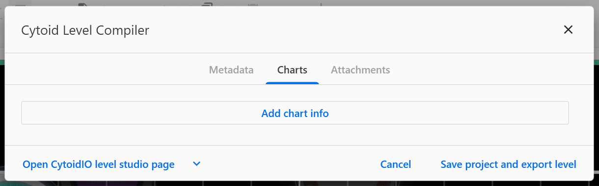
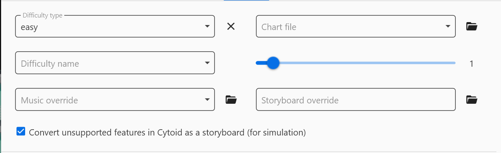
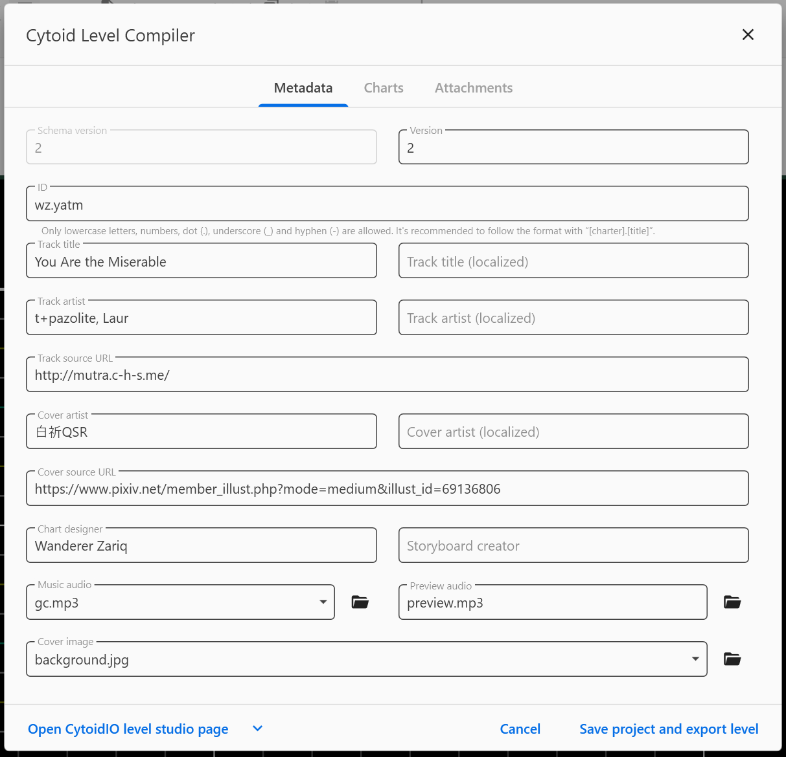
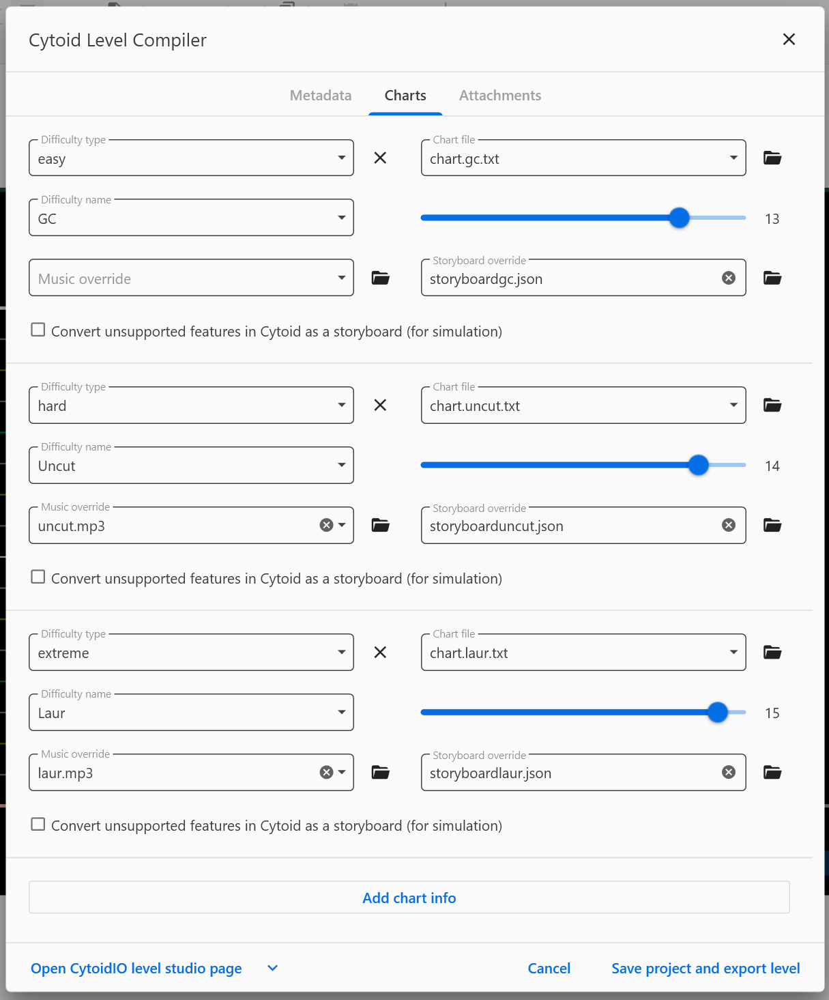
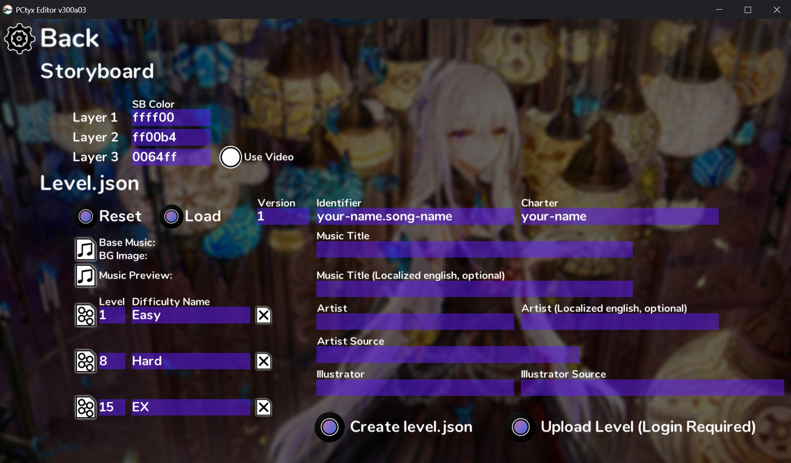
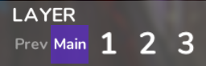
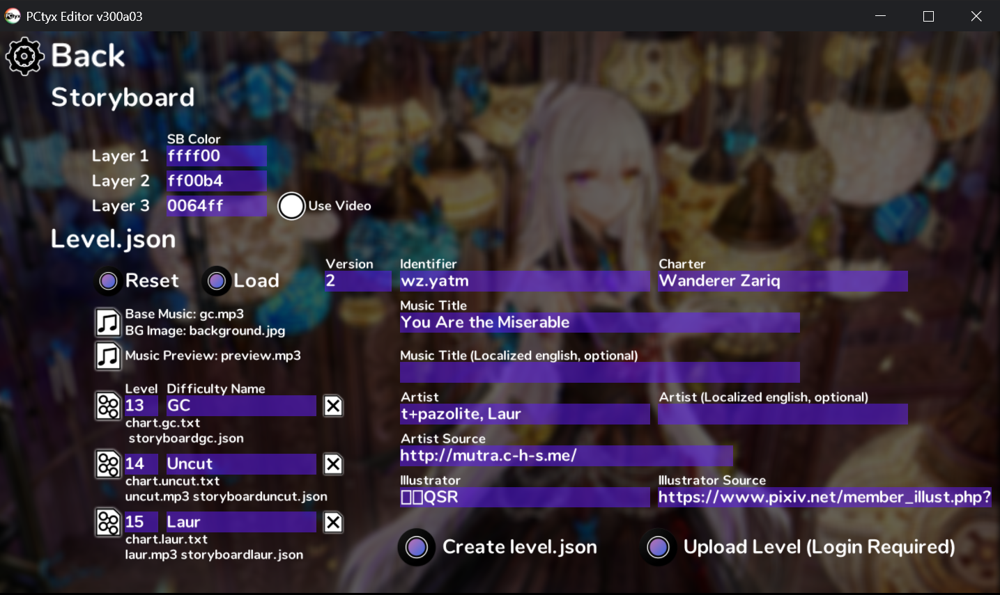

# Packing into a .cytoidlevel file

You have finished your chart! Now how can we play it on Cytoid?  
You will need to pack your files into a `.cytoidlevel` file.

## Packing by using Cylheim

After finishing your chart, click the top-left button and look down, then click *Export to Cytoid*. You will see the following window:

Just type what it tells you to do and click on *Charts* after doing so.

In the *Charts* tab, you will see the following:

Click on *Add chart info* first then this will show up:

You **must** add the chart file and change the difficulty from the slider (that goes from ? to 15+).  
And for *Convert unsupported features in Cytoid as a storyboard (for simulation)*, you **only** have to tick the box if you have:

- Added any event type other than **Speed up / Speed down**
- Changed the Argument in *Page Manager*

If you have done it correctly, you should have the compiler looks something like this:

## Packing it manually

To do so, first make sure you have the following files:

- A [`level.json`](../cytoid/level-json.md) file
- A chart file (at least)
- Music file (`.ogg` recommended)
- Music preview file (has to be less than 30 seconds)
- Background image (`.jpg` or `.png` only)

You can also include the storyboard file(s) if you have it (them).

Now, select everything, zip it, change the `.zip` extension type to the `.cytoidlevel` type and rename the file to your ID (e.g., If your ID is `abcd.efg`, rename the zip to `abcd.efg.cytoidlevel`).

## Packing with a help of PCtyx

You can generate a level.json file on PCtyx to make packing easier.  
After finishing your chart on PCtyx, go back to the menu and click *Cytoid Settings*, and you should then see the following:

Just type what it tells you to do, choose the chart files, then you're finished.

::: warning WARNING!
PCtyx cannot display Japanese characters and will show them as boxes.
:::

For the *SB color*, if you didn't add lines in any other layer (except for the Main layer) while charting, you don’t need to change them.

But if you did, you can customize the SB (lines') color with Hexadecimal RGB.

If you have typed everything necessary, you should have the generator looks something like this:

Click *Create level.json*, repeat the zipping steps (have mentioned before), and finish!

::: tip INFORMATION
We used Wanderer Zariq's *You're the Miserable* as an example for this article. Try it [here](https://cytoid.io/levels/wz.yatm).
:::
