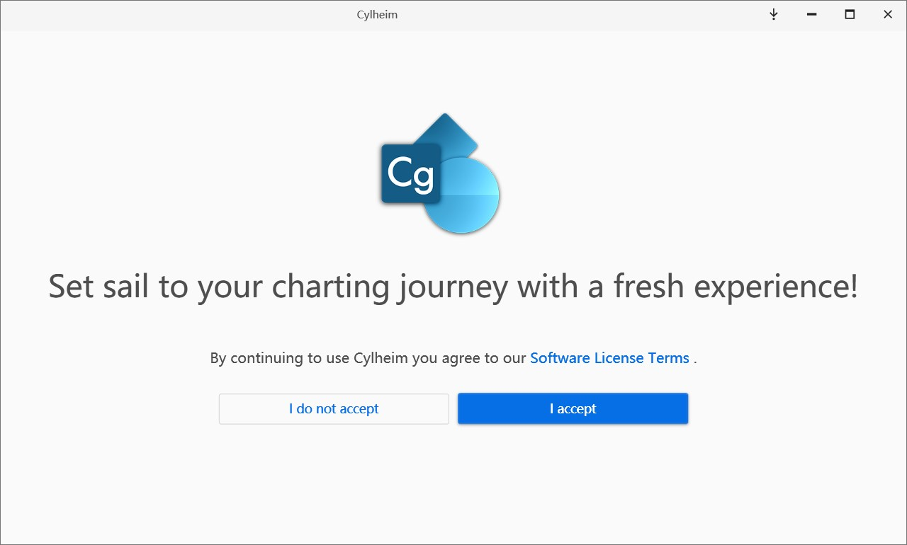
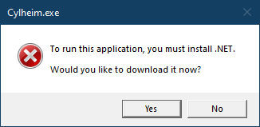
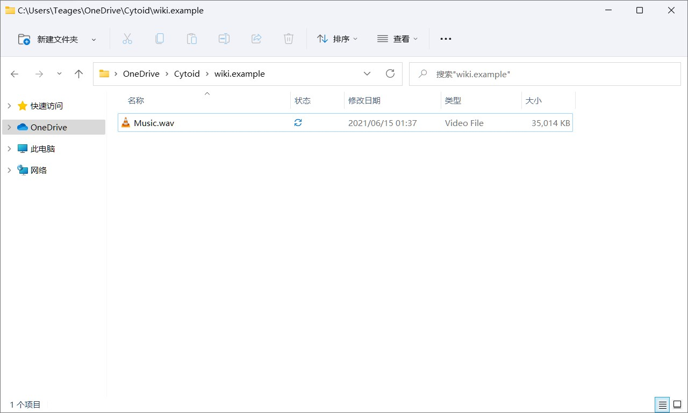
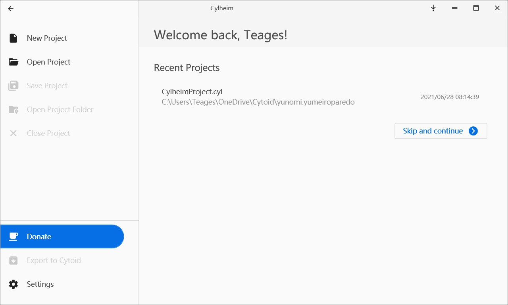
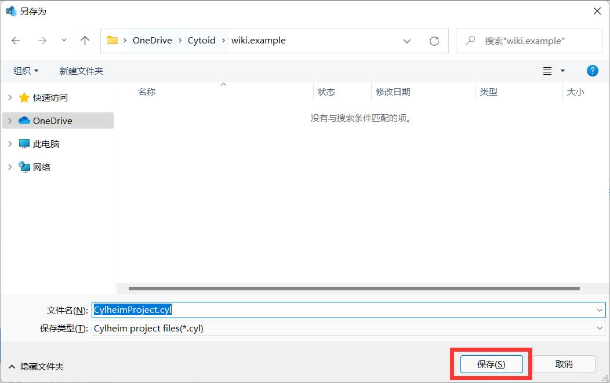
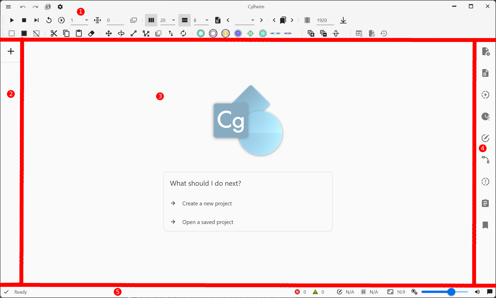
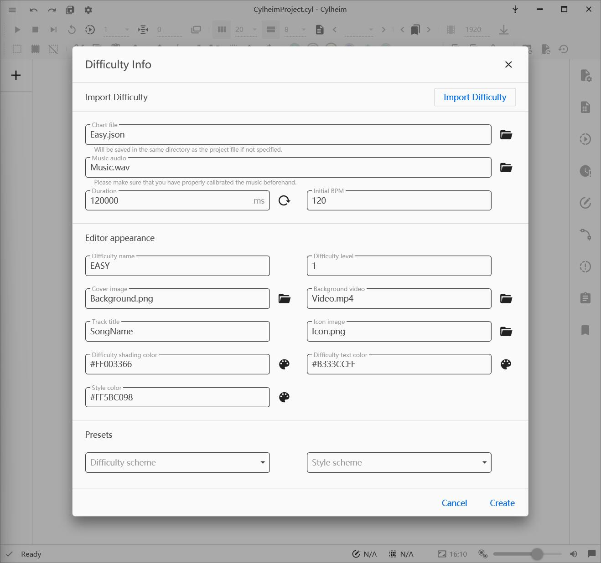
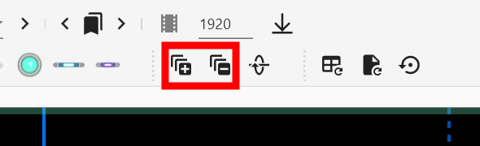

# Charting with Cylheim

## Getting binaries and running Cylheim

1. Go to Cylheim's repository on [GitHub](https://github.com/Horiztar/Cylheim-Windows/) or **download via the [Microsoft Store](https://www.microsoft.com/store/apps/9PCCZSWG973K)(Windows 10/11 only) (Recommended)**.

> If you downloaded Cylheim via the Microsoft Store, skip to step 4.

2. Look at the Right Sidebar, click on [**Releases**](https://github.com/Horiztar/Cylheim-Windows/releases).

3. Download the installer depending on your architecture, run it, and follow the on-screen steps to install Cylheim.

::: warning NOTICE!

Please choose the correct architecture (if you don't know, see in Settings or Control Panel). If not, Cylheim might not work nicely.

:::

4. Run Cylheim

5. If this is your first time running Cylheim, this screen will show up, click *I accept*.

If an error message that appears like this image below showed up, please install .NET 6 Desktop Runtime [here](https://dotnet.microsoft.com/download/dotnet/6.0).

## Using Cylheim

Before we start, you should prepare an edited audio file (we have mentioned how to do it [here](../audio.md)). For this tutorial, we'll use Yunomi\'s track: [*夢色パレード (w/ 桃箱 & miko)*](https://iamyunomi.bandcamp.com/track/w-miko-6) (CC BY-NC-SA 3.0 licensed).

For easier chart management, we recommend that you should put in a separate folder for each track, like this:

When you're ready, you can move to the next section.

## Start charting

When you open Cylheim (or after accepting Cylheim's terms of use in the first run), you can see the welcome screen.

Next, click *New Project* and create the project file in the folder.

### A look at the UI

Now, we will take a look at Cylheim's UI:

1. Toolbar & Title bar: You can hover over the icons to know their function.

2. Chart list: This will help manage each chart in your current chart project, and the *+* button creates an empty chart file for you.

3. Designer view: This is where you can create notes and see the note placement on a page.

4. Sidebar: Use it to perform advanced operations in the chart.

5. Status bar: from left to right: Cylheim status, chart inspection, total note count, selected note count, previewing aspect ratio, note size controller, audio/tap FX volume, notifications.

### Creating a new chart

When you click the *+* button in the chart list, a window appears.

{.side-img}

It is divided into four parts by lines. From up to down, their functions are **importing chart file**, **basic information of the chart**, **editor appearance**, and **presets for the appearance**.

However, the only information of the chart we need to type is the basic information of the chart, which are **chart file's name**, **the path to the music file**, and **the initial BPM**.

> Duration will be automatically detected and filled in after choosing a music file, so you don't need to type them manually.

We will make an Easy difficulty for the song, so the chart name should be `Easy.json`, choose the music file, and type in the BPM of the song, which is `160`.

Click *Create* and let's start!

### Basic usage

Cylheim's controls are simple to learn!

#### Understanding the Shortcuts

|Default shortcut             |Function                                |
|-----------------------------|----------------------------------------|
|Space                        |Start/stop the chart playback           |
|Ctrl+Space                   |Stop and stay at that page              |
|Ctrl+Z                       |Undo                                    |
|Ctrl+Y                       |Redo                                    |
|Ctrl+C                       |Copy                                    |
|Ctrl+V                       |Paste                                   |
|Ctrl+X                       |Cut                                     |
|Ctrl+A                       |Select all notes on the current page    |
|Ctrl+Shift+A                 |Select all notes                        |
|Scroll wheel up / Page Up    |Go to the previous page                 |
|Scroll wheel down / Page Down|Go to the next page                     |

You can also go to **Settings --> Shortcut** to edit the shortcuts for your preference.

#### Adding notes

You can add all kinds of notes with your mouse easily (excluding C-Drag).

##### Adding Click notes

Move your cursor to where you want to add the note, then **left-click**.

##### Adding Hold / Long hold notes

Move your cursor to where the Hold note should start, **left-click** and hold, then move your cursor to where the Hold note should end and release the click.

::: tip Tip: Adding Long holds
Use the shortcut to switch between pages while adding to make your Hold note cross-page.

Hold notes will turn into Long hold notes when it is cross-page.
:::

##### Adding Flick notes

**Left-click and hold** on where the Flick note should be, then drag left / right until you see the click note become a Flick note, here you can release your **left-click**.

##### Adding Drag notes

**Right-click and hold** on where the drag starts, move the cursor to where you want the Drag notes added, and **left-click**, you may continue holding **right-click** and repeat to add more drag notes.

When you have done adding, release your **Right-click**.

::: tip Tip: Connecting and Disconnecting drags
Select the drag notes you want to connect and click the *Connect* button from the toolbar. Same do if disconnect, select the drag notes and click the *Disconnect* button.
:::

::: tip Tip: Extending drags
Select then **right-click and hold** the drag you want and **left-click**.
:::

::: tip Tip: Cross-page drag
Use the shortcut to switch between pages while holding **right-click** to make your drag notes cross-page.
:::

::: tip Tip: Adding Click-drag (C-Drag)
While adding, hold **Shift** then **Left-click**, and the drag will become a C-Drag.
:::

#### Scanline speed

Cylheim uses C2's format, so for speed changes, you can consider one of these options.

##### Change page's size

Cylheim has two buttons to perform.

You can also change the size to exactly what you want by opening
**Sidebar --> Page manager**.

::: tip Tips:
Don't know why? [Try reading C2's chart format article](../chart-json).
:::

##### Changing BPM

::: warning Warning!
**Only** change the BPM when:

- Changing Page size doesn't give you the result you wanted
- The song itself changes its' BPM
:::

You may do so by opening **Sidebar --> Tempo Manager**.

::: tip Changing existing tempo
Find out that the start tempo is wrong? Want to change an existing tempo? You can add a new tempo value on the same tick to override them.
:::
::: tip Keeping where things are after changing the tempo
Changing tempo may off-sync existing stuff on the chart (Notes, Event, Chart/Page duration), *Tempo Manager* has an option to keep these in sync.
:::

#### Generating events

You need to add *Speed up / Speed down* warnings if there are scanline speed changes.

You can use the shortcut **Ctrl + E** to let Cylheim do it automatically.

#### Playback speed

Playback speed may need to be changed to get more accurate sounds.

::: tip Increasing the accuracy of slow playback

You can increase the accuracy of slow playback by turning on *Alter audio sampling rate for playback speed adaptation* in **Settings --> Audio**.

But it will pitch down the song you're playing.

:::

## Sharing and packing your chart

### Record a chart preview of your chart

Cylheim has a built-in chart player at the Playback window button on the toolbar.

Use recording software to record the video (you can try [OBS Studio](https://obsproject.com/download)).

::: tip Tips

If you need to record with a low-end computer due to different reasons, we have the following ways to lower the lags:

- Record with lower resolution
- Slowdown playback and speed it up with video editors
- Close all unused apps to save some CPU usage (Cylheim uses CPU resources for the playback window)

If these tips aren't helpful, try using Xbox Game Bar or using another video recorder.

:::

### Packing into a Cytoidlevel file

Cylheim has a build-in Cytoid level packer, which will export your chart(s) into a Cytoid level.

Click the top-left button and look down, then click *Export to Cytoid*.

Follow the tips, fill in the metadata and chart, and finished!

::: tip Tip: Adding Storyboard?
You can also include storyboard files and resources while packing.
:::

A more in-depth tutorial about packing is available [here](../cytoid/packing.md#packing-by-using-cylheim)

## Video Tutorial (in Chinese, outdated)

<BilibiliPlayer
  aid="798679631"
  bvid="BV1Ly4y1m7Np"
  cid="283509706"
/>
