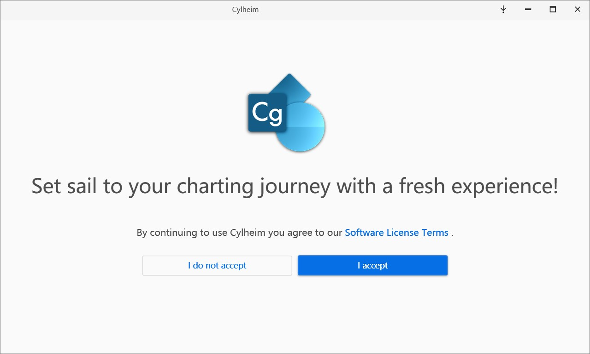
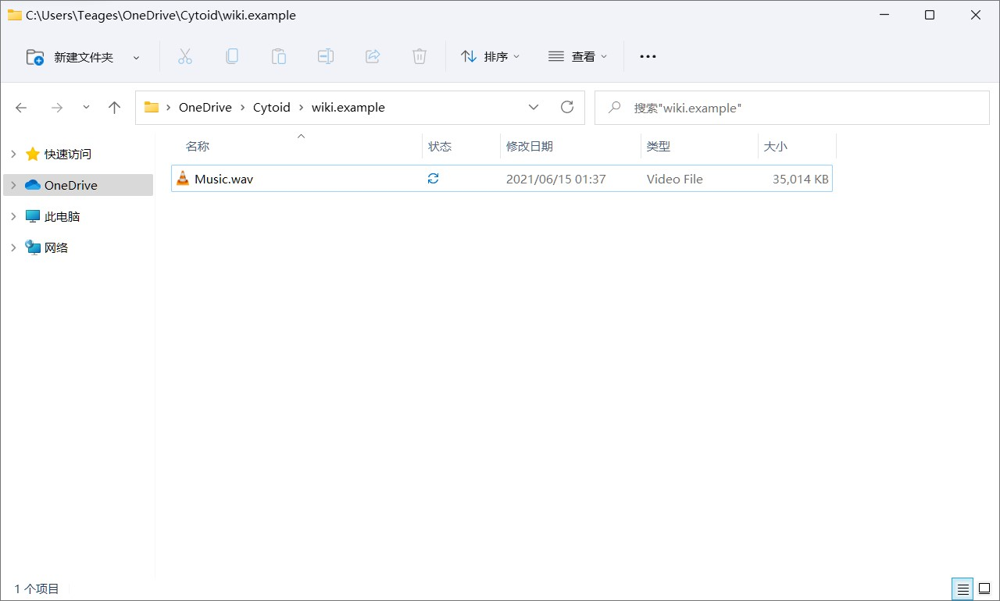
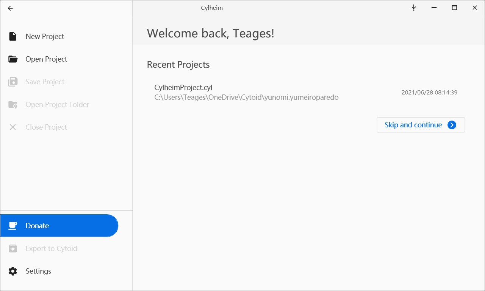
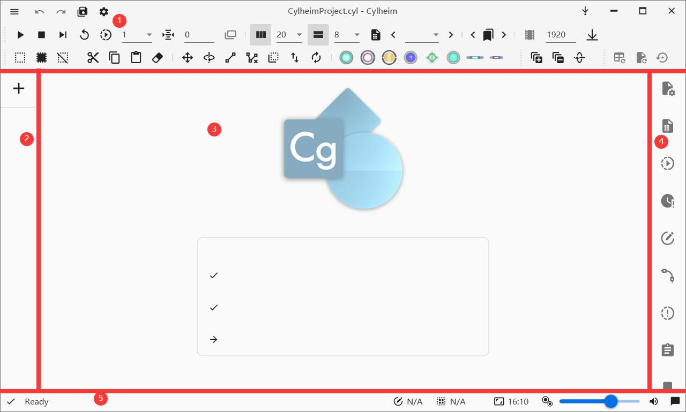
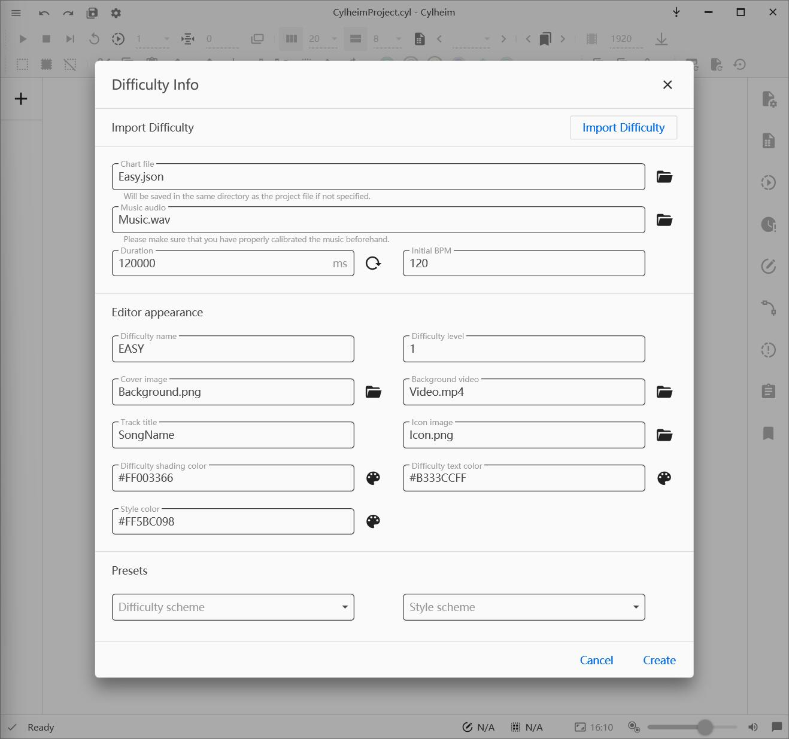
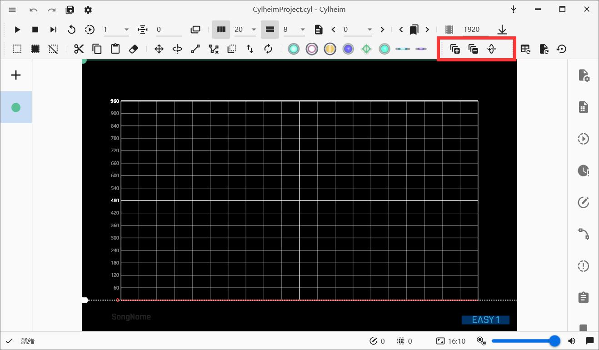

# Getting binaries and running Cylheim 

1. Go to Cylheim's repository on [GitHub](https://github.com/Horiztar/Cylheim-Windows/).

2. Look at the right sidebar, click on *Releases*.

3. Download the zipped file depending on your architecture.

::: warning NOTICE!

Please choose the correct architecture (if you don't know, see in Settings or Control Panel). If not, Cylheim might not work nicely.

:::

4. Extract the zipped file to the folder you wanted (if you can't open and extract the file, download [*7-Zip*](https://www.7-zip.org/)).

5. Go to the Cylheim folder, run *Cylheim.exe.* If this is your first time running Cylheim, you'll see the *Terms of use agreement* window, click *I accept* to continue.

If there is a message appearing like this image below, please install .NET 6 Desktop Runtime [here](https://dotnet.microsoft.com/download/dotnet/6.0).

# Using Cylheim

Before we start, you should prepare an edited audio file (we have mentioned how to do it in the previous article). For this tutorial, we'll use Yunomi\'s track: [*夢色パレード (w/ 桃箱 & miko*)](https://iamyunomi.bandcamp.com/track/w-miko-6) (CC BY-NC-SA 3.0 licensed).

For easier chart management, we recommend that you should put in a separate folder for each track, like this:

When you're ready, you can move to the next section.

## Start charting

When opening Cylheim (or after accepting Cylheim's terms of use in the first run), you can see the welcome screen.

Next, click *New Project* and create the project file in the folder

### A look at the UI

Now, we will take a look at Cylheim's UI

{.side-img}

1. Toolbar & Title bar: You can hover over the icons to know their function.

2. Chart list: This will help manage each chart in your current chart project, and the *+* button helps you create a chart.

3. Designer view: This is where you can create notes and see the note placement on a page.

4. Sidebar: Use it to perform advanced operations in the chart.

5. Status bar: from left to right: Cylheim status, chart inspection (not included in the image), total note count, selected note count, previewing aspect ratio, note size controller, audio/tap FX volume, notifications.

### Creating a new chart

When you click the *+* button in the chart list, a window appears.

{.side-img}

It is divided into four parts bylines. Their functions are **importing chart files**, **basic information of the chart**, **editor appearance**, and **presets for the appearance** (from up to down).

However, we just have to type the basic information of the chart here, which are: **chart file's name**, **the path to the music file**, and **the initial BPM**.

> Duration will be automatically detected and filled in after choosing a music file, so you don't need to type them manually.

We will make an Easy difficulty for the song, so the chart name should be `Easy.json`, choose the music file, and type in the BPM of the song, which is `160`.

Click *Create* and let's start!

### Basic usage

> Cylheim's controls are simple to learn!

#### Understanding the Shortcuts

You can also go to **Settings --> Shortcut** to edit the shortcuts for your preference.

|Default shortcut             |Function                                |
|-----------------------------|----------------------------------------|
|Space                        |Start/stop the chart playback           |
|Ctrl+Space                   |Stop and stay at that page              |
|Ctrl+Z                       |Undo                                    |
|Ctrl+Y                       |Redo                                    |
|Ctrl+C                       |Copy                                    |
|Ctrl+V                       |Paste                                   |
|Ctrl+X                       |Cut                                     |
|Ctrl+A                       |Select all notes on the current page    |
|Ctrl+Shift+A                 |Select all notes                        |
|Scroll wheel up / Page Up    |Go to the previous page                 |
|Scroll wheel down / Page Down|Go to the next page                     |

#### Add notes

> You can add all kinds of notes with your mouse easily (excluding C-Drag).

##### Add Click notes

Move your cursor to where you want to add the note, then **left-click**

##### Add Hold / Long hold notes

At where the Hold note starts, **left-click** and hold, then move your cursor to where the Hold note ends and release the click.

::: tip Tips: Long holds

While holding, you can use shortcuts and go to the next page, which also extends the hold notes to the next page(s).

Hold note will turn into the Long hold note when it is longer than one page.
::::

##### Add Flick notes

**Left-click and hold** on where the Flick note should be, then drag left / right until you see the click note becomes the Flick note, here you can release your **left-click**.

##### Add Drag notes

**Right-click and hold** on where the drag starts, move the cursor to where the drag notes should be added, and **left-click,** you may continue holding the **right-click** button and repeat to add more drag notes.

::: tip Tips

Connecting and Disconnecting drags: Select the drag notes you want to connect and click the *Connect* button from the toolbar. Same do if disconnect, select the drag notes and click the *Disconnect* button.

Extending drags: Select then **right-click and hold** the drag you want and **left-click**.

Cross-page drag: Use the shortcut to switch in between pages while holding **right-click** to make your drag notes cross-page.

Click-drag (C-Drag): While adding, hold **Shift** and then drag will become a C-Drag

:::

#### Scanline speed

Cylheim uses C2's format, so for speed changes, you can consider one of these options.

##### Change page's size

Cylheim has two buttons to perform.

You can also change the size to exactly what you want by opening
**Sidebar --> Page manager**.

::: tip Tips:

Don't know why? [Try reading C2's chart format article](../chart-json).

:::

##### Changing BPM

::: warning Warning!
**Only** change the BPM when:

1. Changing Page size doesn't give you the result you wanted
2. When the song itself changes its' BPM

You may do so by opening **Sidebar --> Tempo Manager**

:::

:::tip Tips

Changing existing tempo: Find out that the start tempo is wrong and want to change an existing tempo? You can add a new tempo value on the same tick to override them.

Keeping where things are while changing tempo: Changing tempo may off-sync existing stuff on the chart (Notes, Event, Chart/Page duration), *Tempo Manager* has an option to keep these in sync.
:::

#### Generating events

You need to add *Speed up / Speed down* warnings while scanline speed changes.

You can use the shortcut **Ctrl + E** to let Cylheim do it automatically.

#### Playback speed

Playback speed may need to change to get more accurate sounds

::: tip Tip

You can increase the accuracy of slow playback by turning on **Alter audio sampling rate for playback speed adaptation** in **Settings --> Audio**

:::

It will pitch down the song you're playing.

## Sharing and packing your chart

### Record a chart preview of your chart

Cylheim has a built-in chart player at the Playback window button on the toolbar.

Use recording software to record the video (you can try [OBS Studio](https://obsproject.com/download))

::: tip Tips

If you need to record with a low-end computer due to different reasons, we have the following ways to lower the lags:

1. Record with lower resolution
2. Slowdown playback and speed it up with video editors
3. Turn off all unused apps to save some CPU usage (Cylheim uses CPU for the playback window)

If these tips aren't helpful, try using Xbox Game Bar or using another video recorder

:::

### Packing into a Cytoidlevel file

Cylheim has a build-in Cytoid level packer, which will export your chart into a Cytoid level.

Click the top-left button and see in the menu, click *Export to Cytoid*

Follow the tips, fill in the metadata and chart, and finished!

::: tip Tip: adding Storyboard?

You can also include storyboard files and resources while packing :wink:.

:::

# Video Tutorial (in Chinese, outdated)

<BilibiliPlayer
  aid="798679631"
  bvid="BV1Ly4y1m7Np"
  cid="283509706"
/>
