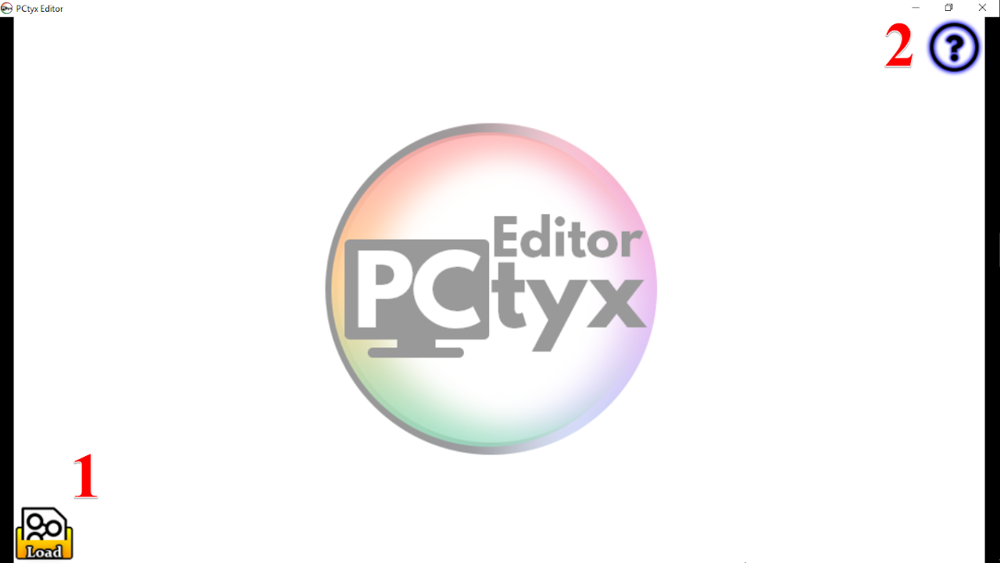
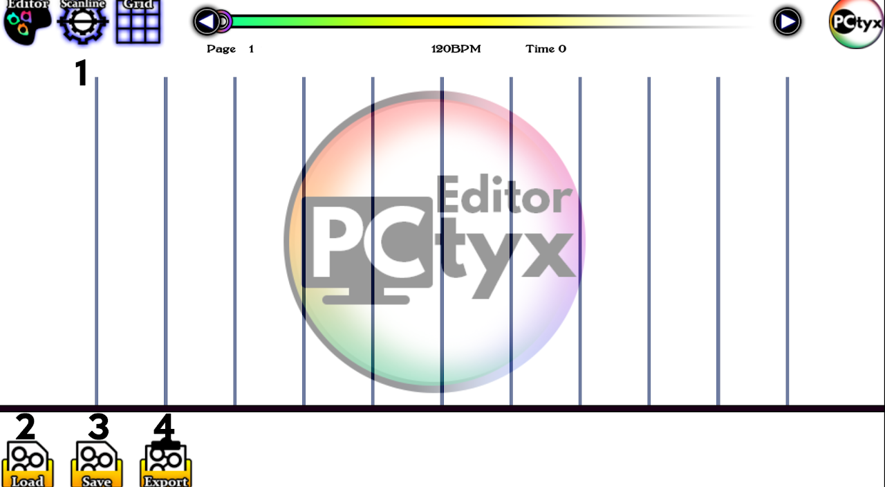
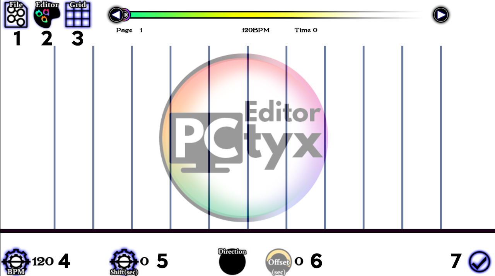
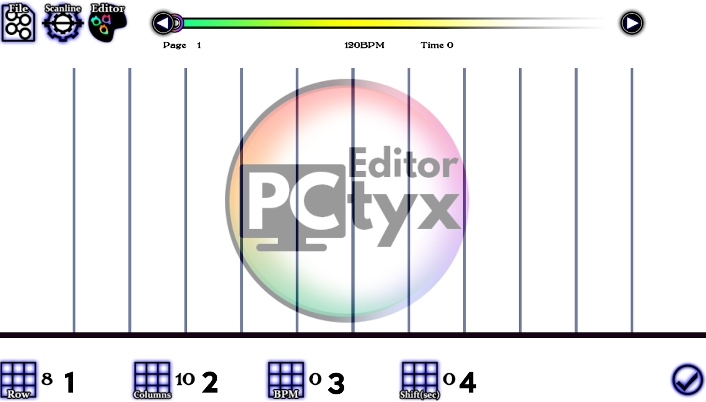
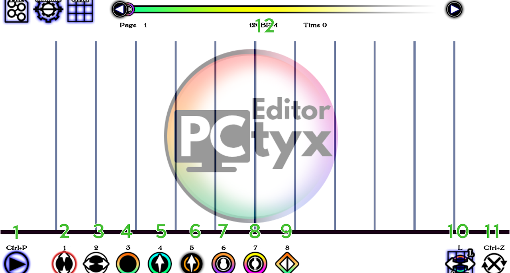
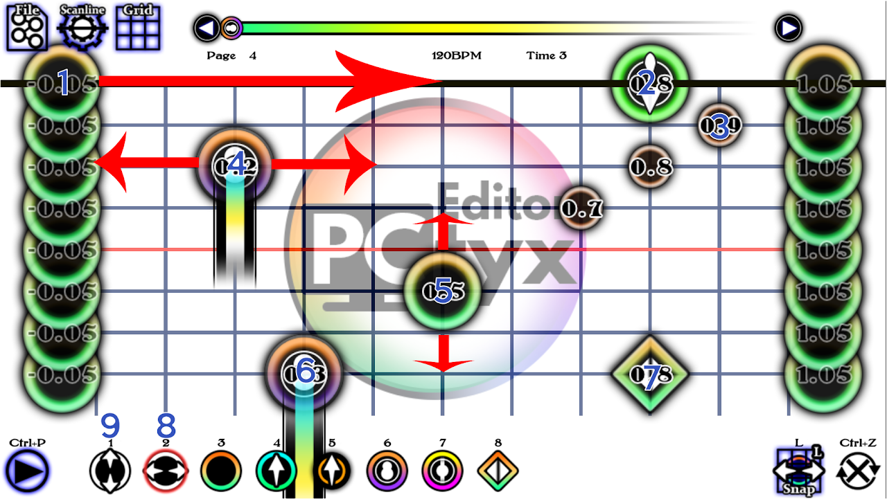
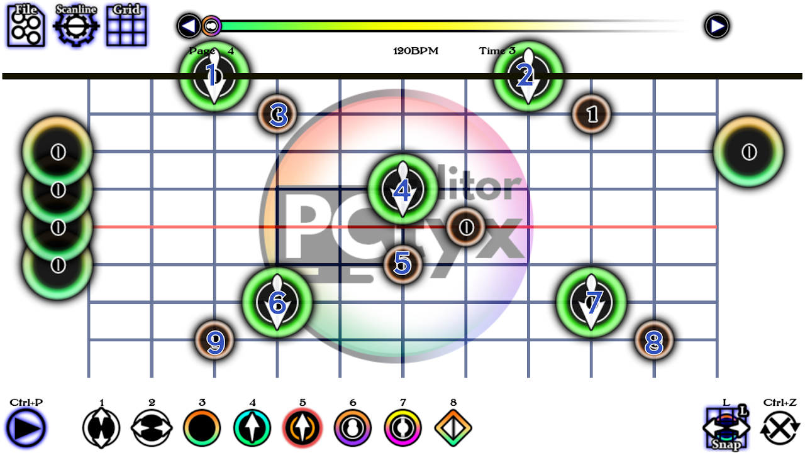
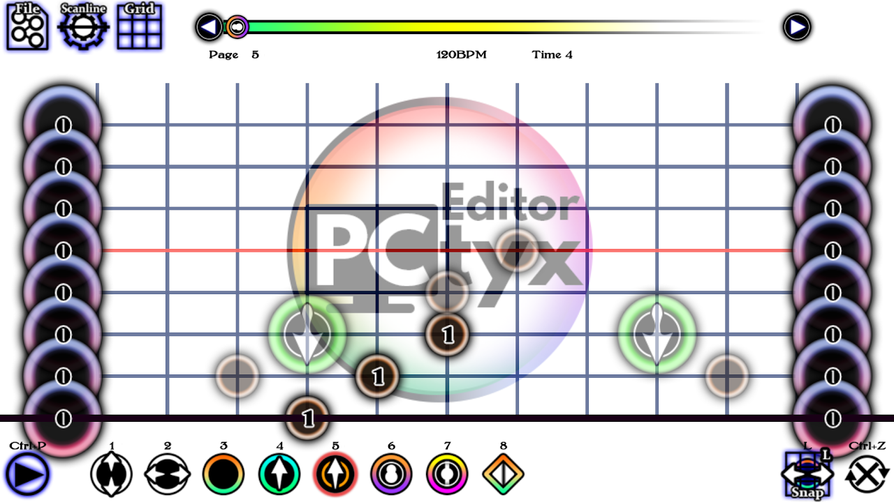

# Chart with PCtyx

::: warning NOTICE!
The Article here is for the old version of PCtyx(v130).

The Article for new Version comming soon
:::

PCTyx is a charting program made by JCEXE. Intended as the successor of Project Thrynox. The guide has been updated for C2 format standards. 

This is an introduction to PCTyx charting. More detailed and easier guide of PCTyx has been made by CrowFX (which is outdated for some parts) which you can see here.

- [User Interface(by CrowFX)]()

- [Charting]()

## User Interface

### I. Startup

1. Load button: Open/Continue a project. You must open at least a supported audio file to start charting.

The file formats supported includes:

- a. Audio Files
    - .mp3 (only file type that can support Cytoid)
    - .m4a
    - .ogg
- b. Chart Files
    - .csv    (When you save a chart, this is the file type you should get. If you are making a c2 formatted chart, you will make it with this.)
    - .cytus.txt    (Universal format used for Cytus 1 and Cytoid)
- c. Background Video (Optional, Does not work on Cytoid)
    - .mp4
    - .ogv
- d. Background Image (Optional in PCtyx, mandatory on Cytoid)
    - .jpg
    - .png

2. Question mark(?): A hyperlink for [http://cytus-fanon.wikia.com/wiki/User_blog:JCEXE/PCtyx](http://cytus-fanon.wikia.com/wiki/User_blog:JCEXE/PCtyx). This is to check for PCtyx's newest updates, or to ask/report bugs to the developer, JCEXE.

To start a new project, click the load button and select the audio file needed for charting. This brings you to the next step:

### II. The editor

#### A) Files options screen 

1. Scanline button: Goes to scanline section.

2. Load: Loads more files that you need.

3. Save: saves the .csv file. Recommended when you are going to stop charting, or if you're charting for a long period of time, just saving it every hour or so just in case all hell breaks loose. If you are charting in C2 format, you will need the .csv for the converter to work.

4. Export: Only used when you are making a c1 chart, this will convert all of your charting data to the c1 format.

#### B) Scanline screen

1. File: If need to add additional files, press this to locate to the second screen.

2. Editor: Use this to go to the editor.

3. Grid: Use this to go to the grid.

4. BPM:Speed of the scanline, or the BPM of the song. Insert the bpm here, but if you want to make the scanline go faster than the original bpm, I recommend using only multiples of x0.5, x1.0, x1.5, or x2.0. Anything else may be used, but make sure that the scanline is on sync.

5. Shift: Adjusts the offset of the song so that the scanline rebound can match the song. Insert the time for the first significant beat of your song. If you use offset, just set it at 0.

6. Offset: Insert your offset here. This shares the same properties with osu's offset. If the shift is 1.131 seconds, than the offset would be 1131. Recommended to use the shift instead.

7. Confirm: Confirms your changes.

Not listed here: Direction

Click on it and you should have 3 different options: Blank, U/D , and D/U. If you want your scanline to start from the top and go down on the first page, then select U/D. If you want your scanline to start from the bottom and go up on the first page, then select D/U. The blank is for when you don't care, and in most cases leaving it blank is better unless you know what you're doing.

#### C) Grid snapping screen

1. Row: Depends on your BPM, but 8 and 16 are good examples for 4/4 charts. If you do not select this correctly, you will have a very hard time trying to time your notes.

2. Column: How many columns you would like when charting, 18,6,24,12,and 20 are what a lot of people use.

3. BPM: Has no purpose.

4. Shift(grid): Shifts grid. Don't use it if you're charting Cytus II charts.

#### D) Editor Screen

1. Playtest: See your chart in action.

2. Move y-axis: Move your note vertically.

3. Move x-axis: Move your note horizontally.

4. Tap Note: Changes your note type to a tap note, can also be used for removing notes.

5. Drag parent note: Changes your note type to a drag head note type. You can assign link IDs with Q to increase the ID value and E to decrease the ID value. Drags with the same ID value will be linked, while those that are different will not. Please refer the Drags section for more info.

6. Drag child note: Changes your note type to a drag child note type. Works Similar to 5.

7. Hold note: Changes your note type to a hold note type. Use Q to increase the hold time and E to decrease the hold time. You may use Right click and Left click for the same function.

8. Long Hold note: Changes your note type to a long hold note. Only works in c2 format. Make sure to save in .csv when you are using c2 type notes.  Long hold note, but recommended to use the hold note instead, as the csv to c2 converter automatically converts any hold notes that goes beyond the inbound line (or if it's too long for the hold to contain in one page).

9. Flick note: Changes your note type to a Flick note. Only works in c2 format.

10. Snap: When deselected, the notes will not snap to the nearest grid. This is not recommended when you are moving notes horizontally. 

11. Flip: Flips your page.

12. Page navigation: using the little circle, you can use this to navigate through pages. Left arrow and Right arrow is used when you are moving through pages by 1.

Not listed: Everything mentioned above.

##### I) Placing notes, Using Holds

Notes can first be placed using the number 8 option. Click on it or press "2" on your keyboard.

- Notes can be dragged from both sides to make them as a tap note (note 1). The notes on the sides are out of the charting range, and will not show up in-game. 

- An existing note may move horizontally (note 4). Drag the note while pressing your left click button and move the note to the desired position. The value on the note shows the position of the note on the x-axis. The playable range for notes for the x-axis is x ∈ [0,1].

Timing for notes can be moved around using the number 9 option. Click on it or press "1" on your keyboard.

- An existing note may move vertically (note 5). Drag the note while pressing your left click button and move the note to the desired position. The value on the note shows when the timing of the note (in seconds).

The amount of time you would like the player to hold the note can be adjusted using left click and right click.

- On note 4, You can adjust the hold time using left click (to increase) and right click (to decrease). The amount of hold time you may add/remove depends on your grid size.

- Instead of left click, you may use "E" on your keyboard. Instead of right click, you may use "Q" on your keyboard. This applies to drags when assigning ID values to notes.

To change a note back to a tap note, press "3" on your keyboard and click on a note you'd like to revert. This will change it back to a tap note. If you have a note you would like to remove, click on the note with the same option (3) when it is a tap note. 

Note 2 and 3 are examples of drag parent (or drag head) and drag child examples.

Note 6 and 7 are for c2 formatted charts only. 6 are long holds (or holds that cannot be fully contained in the page (that extends the inbound line) and note 7 represents a flick note.

##### II) Drags

{.side-img}

{.side-img}

If you have multiple drags on one page on the y-axis, would like a drag not to be connected, while your cursor is on the note, press Q or E to assign each note with a "connection value". Those with the same value will be connected, or linked, and those that have different values will not. Please do note that a child note cannot link with a parent note, but a child note can link with a child note. Here is an example of this:

- Head note 1 cannot connect with head note 2 when the ID values **in any circumstances**.

- Child note 3 cannot connect with head note 4 **in any circumstances**.

- Head note 2 cannot connect with child note 3 when the ID values are **different**.

- Child note 8 and child note 9 cannot connect when the ID values are the same **in any circumstances**. If they have the same ID values, both child notes **will be hidden** from the playtest.

- If Head note 1 and 2 and child note 3 ID values are the same, this will cause a bug in PCtyx. **Please avoid doing this.**

- If Head note 4 was a child note, and Notes 1, 3, 4 shared the same ID values, **All three notes would be linked**.

- Cross page drags work if the notes share the same ID value and **no drag heads are present**.

:::danger NEED HELP?
Have any other questions? Ask questions in #chart-making.

[Charters are here to help you. (Discord)](https://discord.gg/cytoid)
:::
