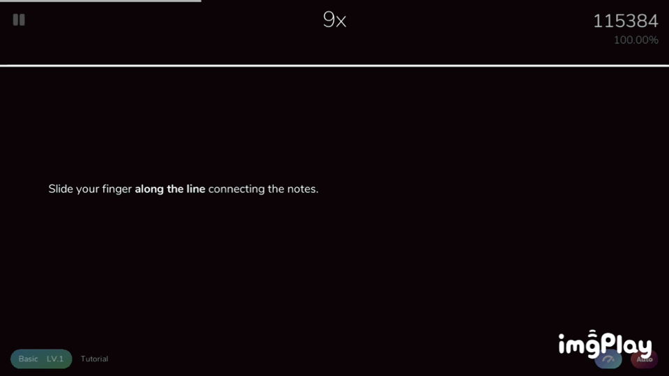

# {{$frontmatter.title}}

## Game UI

## Note types

- There are 6 note types in Cytoid, they're: Tap, Drag, C-Drag, Hold, Long hold, Flick.

### Click

{.side-img}

- You just have to tap whenever the inner colored circle is close to the outer ring.

### Drag

{.side-img}

- Simply slide along the line through the small circles.
- You don't need to wait for the scanner, but don't drag too far ahead because you might mess up your rhythm.

### C-Drag

{.side-img}

- This is a "hybrid note" of Click and Drag.
- Its "drag head" has click note's mechanics.
- That means you have to touch when the scanner reaches it, then slide your finger along the line with connecting notes.

### Hold

{.side-img}

- Have your finger on the circle before the scanner has reached it.
- Hold it there until the scanner has gone to the end of the line coming out of the circle.
- You don't need to release it. You also don't need to tap it like the click note, so you can slide onto it like a drag note.

### Long hold

{.side-img}

- A variant of the hold note.
- You usually need to hold your finger longer than a page.
- You can see how long you need to hold if you look at the pulsing ring around the circle.

### Flick

{.side-img}

- A different version of click notes.
- You need to tap and slide away from it horizontally.

## Ranked vs Pratice

- There are 2 game modes in Cytoid: Ranked and Practice.
- Ranked mode has stricter time windows compared to Practice mode.
- Both modes save your play data online, only if the chart is available on CytoidIO. However, scores made on Practice mode are not displayed on the leaderboards.
- EXP can be earned by playing Ranked or Practice mode, however EXP recieved will be halved in Practice mode.
- Only ranked plays affect your rating.
- Ranked mode is only available to players that have a Cytoid account. (a.k.a. Cytoid ID)

### A comparison of Ranked and Practice

#### Ranked

- Timing windows:
  - Perfect: ±40ms
  - Great: ±70ms
  - Good: -200ms ~ 150ms
  - Bad: -400ms ~ 200ms
  - Miss: >200ms
- This mode uses a **different** scoring system, please read [here](https://github.com/Cytoid/Cytoid/wiki/%23.-Ranked-Mode-scoring)

#### Practice

- Timing windows:
  - Perfect: ±70ms
  - Great: -200ms ~ 150ms
  - Good: -400ms ~ 200ms
  - Bad: -800ms ~ 300ms
  - Miss: >300ms
- This mode uses the **traditional** scoring system.

## Modifiers

Modifiers (or mods) 

### HP modifiers

#### HYPER

> Add an HP bar to the game.

- By enabling Hyper, it will add an HP bar to the game, initial HP value is ``difficulty * 75`` (1000 if it's ? difficulty). If it reaches to 0, you will automatically fail the game.
- HYPER works differently in Ranked and Practice

::: details Practice
|                     |   Perfect   |   Great   |    Good   |    Bad    |     Miss    |
|---------------------|:-----------:|:---------:|:---------:|:---------:|:-----------:|
| Click               |          +1 |       -1% |       -3% |       -6% |         -8% |
| Hold                |        +0.5 |     -1.5% |       -4% |       -9% |        -12% |
| Long hold           |        +0.5 |     -1.5% |       -4% |       -9% |        -12% |
| Drag Head (Child)   | +0.2 (+0.1) | N/A (N/A) | N/A (N/A) | N/A (N/A) | -8% (-2.4%) |
| C-Drag Head (Child) | +0.2 (+0.1) |   0 (N/A) |   0 (N/A) |   0 (N/A) | -8% (-2.4%) |
| Flick               |          +1 |    -0.75% |    -2.75% |       -4% |         -6% |
:::

::: details Ranked
|                     |   Perfect   |   Great   |    Good   |    Bad    |     Miss    |
|---------------------|:-----------:|:---------:|:---------:|:---------:|:-----------:|
| Click               |          +1 |      +0.5 |       -1% |       -3% |         -8% |
| Hold                |        +0.5 |     +0.25 |     -1.5% |       -4% |        -12% |
| Long hold           |        +0.5 |     +0.25 |     -1.5% |       -4% |        -12% |
| Drag Head (Child)   | +0.2 (+0.1) | N/A (N/A) | N/A (N/A) | N/A (N/A) | -8% (-2.4%) |
| C-Drag Head (Child) | +0.2 (+0.1) |   0 (N/A) |   0 (N/A) |   0 (N/A) | -8% (-2.4%) |
| Flick               |          +1 |      +0.5 |    -0.75% |    -2.75% |         -6% |
:::

#### ANOTHER

> Same as HYPER, but more difficult.

- All its mechanics are same as HYPER, but it's adjusted to make more damage if you get a note cleared is not Perfect.
- Like HYPER, ANOTHER also works differently in Ranked and Practice

::: details Practice
|                     |   Perfect   |   Great   |    Good   |    Bad    |    Miss    |
|---------------------|:-----------:|:---------:|:---------:|:---------:|:----------:|
| Click               |          +1 |       -4% |       -8% |      -15% |       -20% |
| Hold                |        +0.5 |       -6% |      -12% |      -20% |       -25% |
| Long hold           |        +0.5 |       -6% |      -12% |      -20% |       -25% |
| Drag Head (Child)   | +0.2 (+0.1) | N/A (N/A) | N/A (N/A) | N/A (N/A) | -20% (-6%) |
| C-Drag Head (Child) | +0.2 (+0.1) |   0 (N/A) |   0 (N/A) |   0 (N/A) | -20% (-6%) |
| Flick               |          +1 |       -3% |       -6% |      -12% |       -15% |
:::

::: details Ranked
|                     |   Perfect   | Great     |    Good   |    Bad    |    Miss    |
|---------------------|:-----------:|-----------|:---------:|:---------:|:----------:|
| Click               |          +1 |         0 |       -4% |       -8% |       -20% |
| Hold                |        +0.5 |         0 |       -6% |      -12% |       -25% |
| Long hold           |        +0.5 |         0 |       -6% |      -12% |       -25% |
| Drag Head (Child)   | +0.2 (+0.1) | N/A (N/A) | N/A (N/A) | N/A (N/A) | -20% (-6%) |
| C-Drag Head (Child) | +0.2 (+0.1) |   0 (N/A) |   0 (N/A) |   0 (N/A) | -20% (-6%) |
| Flick               |          +1 |         0 |       -3% |       -6% |       -15% |
:::

#### Full combo

> Game over if missed a note.

#### All perfect

> Game over if the note cleared is not perfect.

### Flipping modifiers

#### Flip X

> Flips the level on the x-axis.

#### Flip Y

> Flips the level on the y-axis.

#### Flip All

> Flip the level on both axes, i.e. rotate by 180°.

### Approach rate adjusting modifiers

#### Fast

> Notes fade in later.

When Fast is enabled, notes will fade in later, i.e approach rate is higher.

#### Slow

> Notes fade in earlier.

When Slow is enabled, notes will fade in earlier, i.e approach rate is lower.

### Invisibling modifiers

#### No scanner

> The scanner is hidden.

#### Invisible

> All notes are hidden.

### Autoplaying modifiers

::: warning NOTICE!
Enabling any autoplaying modifiers, your score won't be saved (that means your score won't be submitted to CytoidIO, you don't gain any EXP or rating)
:::

#### Auto

> Autoplay the level

- The game will automatically hit all notes

#### Auto Drag

> Autoplay the drag notes

- The game will automatically hit Drag notes

#### Auto Flick

> Autoplay the flick notes

- The game will automatically hit Flick notes

#### Auto Hold

> Autoplay the hold notes

- The game will automatically hit Flick notes

## Game Setttings

## Game Modes

### Free Play

### Events

### Community

### Tiers

### Training
