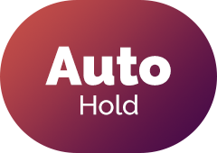

# {{$frontmatter.title}}

Modifiers help players adjust gameplay experience based on their preference. Here is a list of modifiers.

## HP modifiers

### HYPER

{.side-img .icon-img}

> Add an HP bar to the game.

- By enabling Hyper, it will add an HP bar to the game, the initial HP value is ``difficulty * 75`` (1000 if it's ? difficulty). If it reaches 0, you will automatically fail the game.
- HYPER works differently in Ranked and Practice

::: details Practice
|                     |   Perfect   |   Great   |    Good   |    Bad    |     Miss    |
|---------------------|:-----------:|:---------:|:---------:|:---------:|:-----------:|
| Click               |          +1 |       -1% |       -3% |       -6% |         -8% |
| Hold                |        +0.5 |     -1.5% |       -4% |       -9% |        -12% |
| Long hold           |        +0.5 |     -1.5% |       -4% |       -9% |        -12% |
| Drag Head (Child)   | +0.2 (+0.1) | N/A (N/A) | N/A (N/A) | N/A (N/A) | -8% (-2.4%) |
| C-Drag Head (Child) | +0.2 (+0.1) |   0 (N/A) |   0 (N/A) |   0 (N/A) | -8% (-2.4%) |
| Flick               |          +1 |    -0.75% |    -2.75% |       -4% |         -6% |

:::

::: details Ranked
|                     |   Perfect   |   Great   |    Good   |    Bad    |     Miss    |
|---------------------|:-----------:|:---------:|:---------:|:---------:|:-----------:|
| Click               |          +1 |      +0.5 |       -1% |       -3% |         -8% |
| Hold                |        +0.5 |     +0.25 |     -1.5% |       -4% |        -12% |
| Long hold           |        +0.5 |     +0.25 |     -1.5% |       -4% |        -12% |
| Drag Head (Child)   | +0.2 (+0.1) | N/A (N/A) | N/A (N/A) | N/A (N/A) | -8% (-2.4%) |
| C-Drag Head (Child) | +0.2 (+0.1) |   0 (N/A) |   0 (N/A) |   0 (N/A) | -8% (-2.4%) |
| Flick               |          +1 |      +0.5 |    -0.75% |    -2.75% |         -6% |

:::

### ANOTHER

{.side-img .icon-img}

> Same as HYPER, but more difficult.

- All its mechanics are the same as HYPER, but it's adjusted to deal more damage if you get a note cleared that isn't Perfect.
- Like HYPER, ANOTHER also works differently in Ranked and Practice

::: details Practice
|                     |   Perfect   |   Great   |    Good   |    Bad    |    Miss    |
|---------------------|:-----------:|:---------:|:---------:|:---------:|:----------:|
| Click               |          +1 |       -4% |       -8% |      -15% |       -20% |
| Hold                |        +0.5 |       -6% |      -12% |      -20% |       -25% |
| Long hold           |        +0.5 |       -6% |      -12% |      -20% |       -25% |
| Drag Head (Child)   | +0.2 (+0.1) | N/A (N/A) | N/A (N/A) | N/A (N/A) | -20% (-6%) |
| C-Drag Head (Child) | +0.2 (+0.1) |   0 (N/A) |   0 (N/A) |   0 (N/A) | -20% (-6%) |
| Flick               |          +1 |       -3% |       -6% |      -12% |       -15% |

:::

::: details Ranked
|                     |   Perfect   | Great     |    Good   |    Bad    |    Miss    |
|---------------------|:-----------:|-----------|:---------:|:---------:|:----------:|
| Click               |          +1 |         0 |       -4% |       -8% |       -20% |
| Hold                |        +0.5 |         0 |       -6% |      -12% |       -25% |
| Long hold           |        +0.5 |         0 |       -6% |      -12% |       -25% |
| Drag Head (Child)   | +0.2 (+0.1) | N/A (N/A) | N/A (N/A) | N/A (N/A) | -20% (-6%) |
| C-Drag Head (Child) | +0.2 (+0.1) |   0 (N/A) |   0 (N/A) |   0 (N/A) | -20% (-6%) |
| Flick               |          +1 |         0 |       -3% |       -6% |       -15% |

:::

### Full combo

{.side-img .icon-img}

> Game over if missed a note.

### All perfect

{.side-img .icon-img}

> Game over if the note cleared is not perfect.

## Flipping modifiers

### Flip X

{.side-img .icon-img}

> Flips the level on the x-axis.

### Flip Y

{.side-img .icon-img}

> Flips the level on the y-axis.

### Flip All

{.side-img .icon-img}

> Flip the level on both axes, i.e. rotate by 180°.

## Approach rate adjusting modifiers

### Fast

{.side-img .icon-img}

> Notes fade in later.

When Fast is enabled, notes will fade in later, i.e approach rate is higher.

### Slow

{.side-img .icon-img}

> Notes fade in earlier.

When Slow is enabled, notes will fade in earlier, i.e approach rate is lower.

## Invisibling modifiers

### No scanner

{.side-img .icon-img}

> The scanner is hidden.

### Invisible

{.side-img .icon-img}

> All notes are hidden.

## Autoplaying modifiers

::: warning NOTICE!
If you enabled any autoplaying modifiers, your score won't be saved (that means your score won't be submitted to CytoidIO and you won't gain any EXP or rating)
:::

### Auto

{.side-img .icon-img}

> Autoplay the level

- The game will automatically hit all notes

### Auto Drag

{.side-img .icon-img}

> Autoplay the drag notes

- The game will automatically hit Drag notes

### Auto Flick

{.side-img .icon-img}

> Autoplay the flick notes

- The game will automatically hit Flick notes

### Auto Hold

{.side-img .icon-img}

> Autoplay the hold notes

- The game will automatically hit Hold notes

