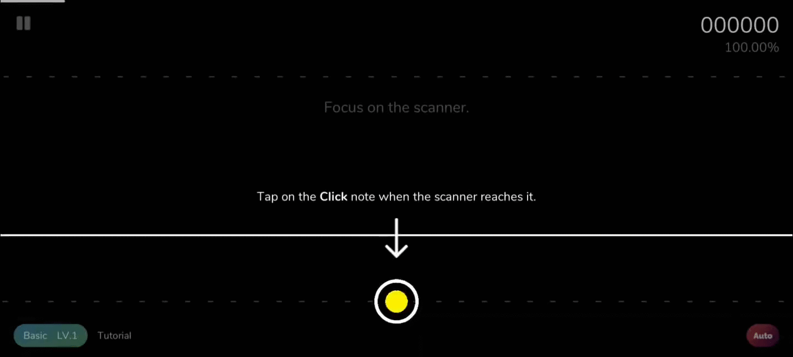
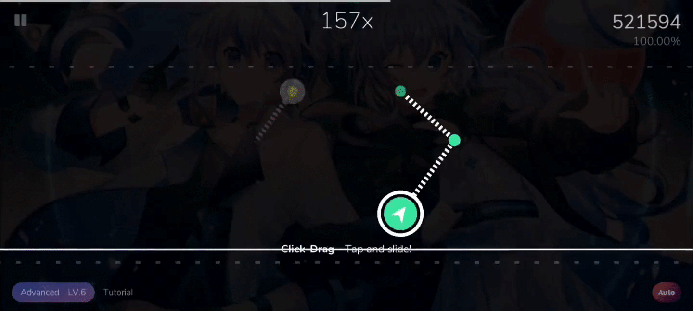
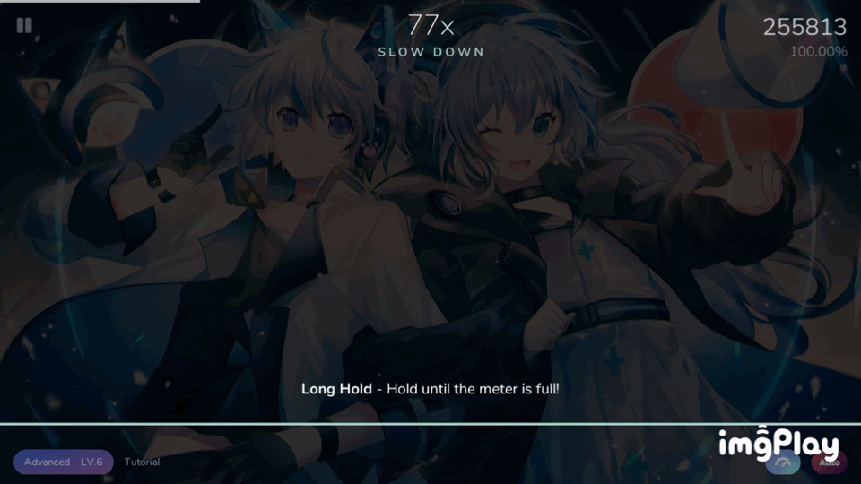
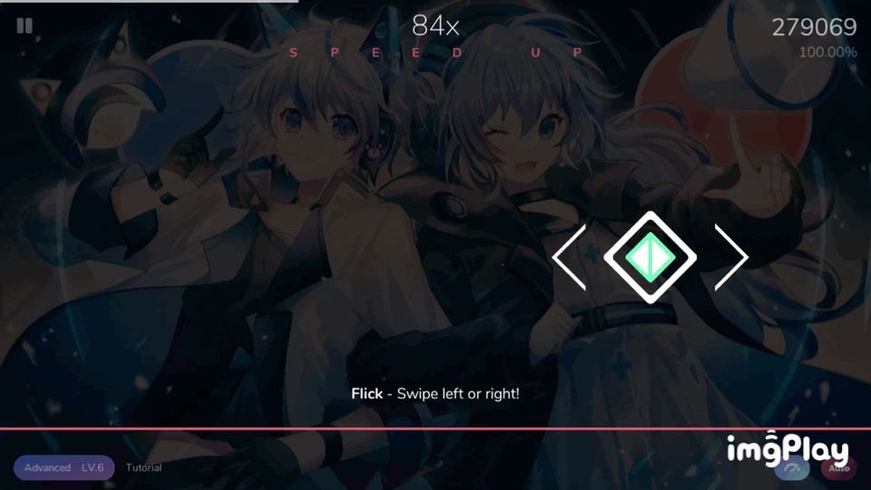

# {{$frontmatter.title}}

## Note types

- There are 6 note types in Cytoid, they're: Tap, Drag, C-Drag, Hold, Long hold, Flick.

### Click

{.side-img}

- You just have to tap whenever the inner colored circle is close to the outer ring.

### Drag

{.side-img}

- Simply slide along the line through the small circles.
- You don't need to wait for the scanner, but don't drag too far ahead because you might mess up your rhythm.

### C-Drag

{.side-img}

- This is a "hybrid note" of Click and Drag.
- Its "drag head" has click note's mechanics.
- That means you have to touch when the scanner reaches it, then slide your finger along the line with connecting notes.

### Hold

{.side-img}

- Have your finger on the circle before the scanner has reached it.
- Hold it there until the scanner has gone to the end of the line coming out of the circle.
- You don't need to release it. You also don't need to tap it like the click note, so you can slide onto it like a drag note.

### Long hold

{.side-img}

- A variant of the hold note.
- You usually need to hold your finger longer than a page.
- You can see how long you need to hold if you look at the pulsing ring around the circle.

### Flick

{.side-img}

- A different version of click notes.
- You need to tap and slide away from it horizontally.

## Ranked vs Pratice

- There are 2 game modes in Cytoid: Ranked and Practice.
- Ranked mode has stricter time windows compared to Practice mode.
- Both modes save your play data online, only if the chart is available on CytoidIO. However, scores made on Practice mode are not displayed on the leaderboards.
- EXP can be earned by playing Ranked or Practice mode, however EXP recieved will be halved in Practice mode.
- Only ranked plays affect your rating.
- Ranked mode is only available to players that have a Cytoid account. (a.k.a. Cytoid ID)

### A comparison of Ranked and Practice

#### Ranked

- Timing windows:
  - Perfect: ±40ms
  - Great: ±70ms
  - Good: -200ms ~ 150ms
  - Bad: -400ms ~ 200ms
  - Miss: >200ms
- This mode uses a **different** scoring system, please read [here](https://github.com/Cytoid/Cytoid/wiki/%23.-Ranked-Mode-scoring)

#### Practice

- Timing windows:
  - Perfect: ±70ms
  - Great: -200ms ~ 150ms
  - Good: -400ms ~ 200ms
  - Bad: -800ms ~ 300ms
  - Miss: >300ms
- This mode uses the **traditional** scoring system.
