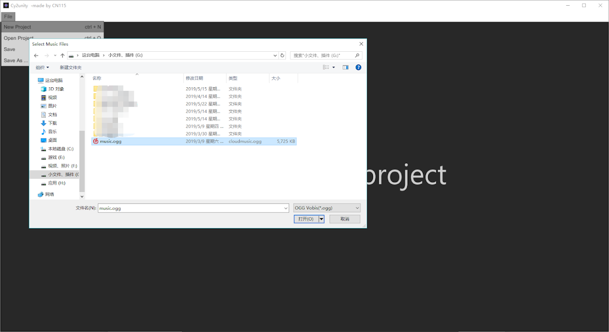
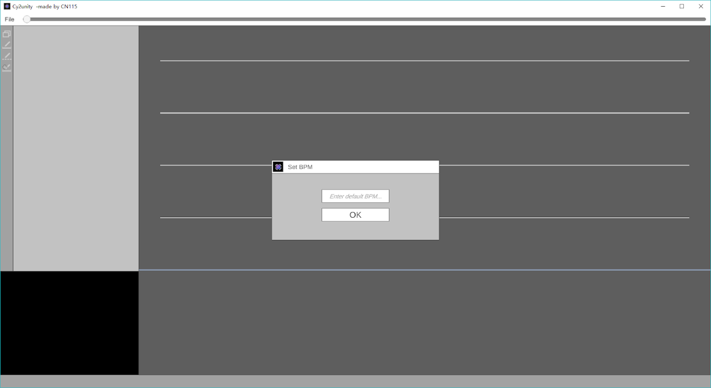
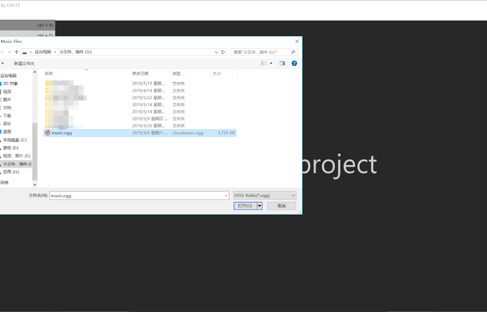
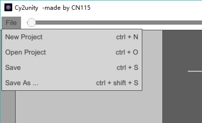
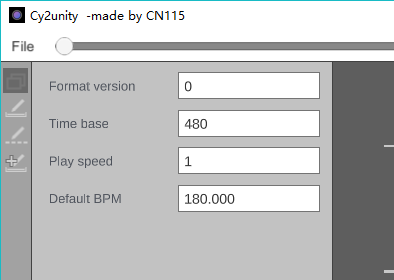
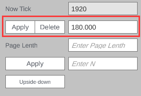
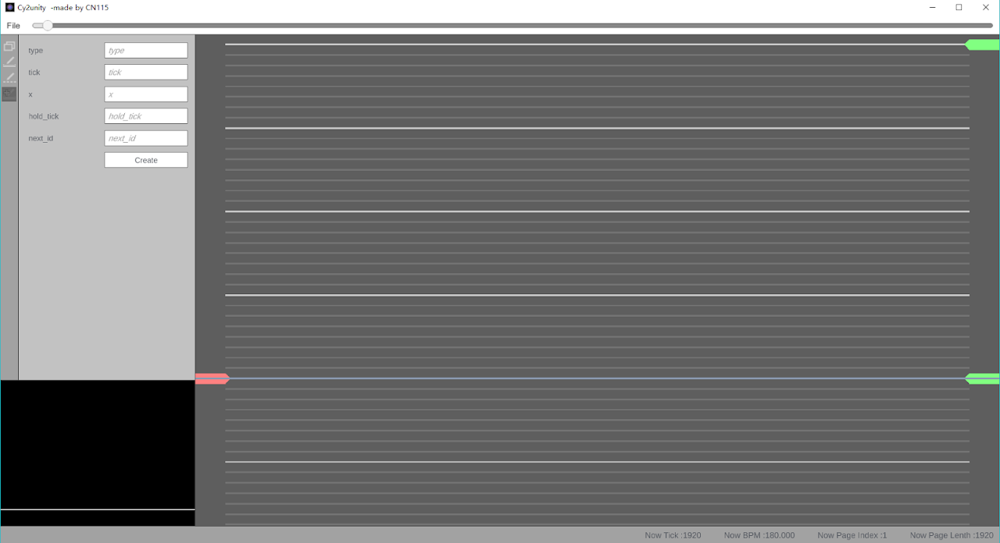

# Charting with Cy2Unity

Note: You need to have basic understanding of the Cytus 2 chart format.
This project is currently in its beta stages. There may be a lot of bugs in the program and is expected to receive multiple patches for the next few months. Here are some known bugs:

- Current Version: 0.1.0

    - Don’t use the “Edit Project” tool for now - it is buggy;

    - Don’t delete the first BPM change.

    - There is severe FPS drop when the note count is larger than 1000.

:::warning NEW VERSION COMMING!!!
The New Verison of Cy2unity is comming.
:::

## 1. Getting Started

Please download the appropriate Cy2unity version for your operating system. We will be using the 64-bit version for our tutorial, but any version will work fine.

Downloads:

- [32 Bit Windows (Discord)](https://cdn.discordapp.com/attachments/380891241082257408/581341715458424845/Cy2unity_Windows_32-bit.zip)

- [64 Bit Windows (Discord)](https://cdn.discordapp.com/attachments/380891241082257408/581341734420611072/Cy2unity_Windows_64-bit.zip)

You will see the following files:

Double-click on Cy2unity.exe to launch the editor. You should see the following screen:

Let’s try creating a project. Click on File → Create Project. You will need to choose a music file in either .wav or .ogg format as .mp3 formats are not supported. If you do not know how to convert a .mp3 file into a .wav/.ogg format, use this online converter.
------

1. After the import is done, you will need to enter a default BPM.

2. Later, you can change this value, or you can set up multiple BPMs for different music sections.
Then you need to enter the value of ticks per page.

3. It is recommended to add 480 for each beat per page, i.e. if you want each page to have 2 beats, enter 960; if you want each page to have 4 beats, enter 1920.
Now you are greeted with the main interface.

4. If you choose to open an existing project at the beginning, you will need to specify both the music file and the chart file (.json).

------

## 2. Main interface

The main interface is shown below:

- **Menu bar (top).** Currently, only the File tab and the progress bar is available. You can drag the progress bar when the music is not playing.

- **Tool bar (left).** 4 tools are currently available. Please read below for details.

- **Properties window (right to Tool bar).** View and edit object properties here.

- **Stage (right).** The blue horizontal line marks the current time, and the white horizontal lines mark the beats.

- **Info bar (bottom).** Info and error messages are displayed here.

- **Preview window (bottom left).** Preview how the chart looks like in-game here.

## 3. Menu bar

File tab. Very straightforward.

## 4. Tool bar

There are only 4 tools on the tool bar now, and they are “Edit project”, “Note brush”, “Edit tempo”, and “Note manual add”.

### Edit Project.

You can edit basic chart metadata here.

**Format version** and **time base** correspond to “format_version” and “time_base” in the Cytus 2 chart format.
**Play speed** controls how fast the chart is played in the editor. The default value is 1.
**Default BPM** is just what its name suggests. It changes the initial BPM only.
You shouldn’t need to change any of these settings.

### Note brush

Note brush is probably the single most important tool now.

In the empty area,

- **Left click** to create a click note.
- **Left click and drag** to create a hold note.
- **Right click** to create a flick note.
- **Right click and drag** to create a drag chain.

On any note,

- **Left click** to select it.
- **Left click and drag** to move it around.
- **Right click on the last drag note of a drag chain** to extend the chain.

When a note is selected,

- **D** to delete it.
- **Ctrl+D** to delete the entire chain, if a drag note is selected.

Other controls:

- **Mouse wheel** to adjust the time.
- **Tab** to turn on/off vertical grid lines.
- **Shift + mouse wheel** to adjust the density of horizontal beat lines.
- **Ctrl + mouse wheel** to adjust the zoom.

### Edit tempo

You can change both the BPM and the tick duration.

#### For changing the BPM:

When the BPM is not changed at the current time, you will see the following:

Enter a new BPM and click “Add”. This will apply to the remaining part of the music.
When the BPM is already changed at the current time, you will see the following:

You can adjust the BPM or delete the BPM change. **Note: there is currently a bug that crashes the editor if you delete the first BPM change. Also, don’t make BPM too small (< 30) or negative.**

#### For changing the tick duration:

You can change the tick duration of the current page (at the current time).

If you click Apply, this page and all subsequent pages will be set to have the tick duration specified, in this case, 1920.
You can also enter a number in the textbox right to the Apply button:

If you click Apply, only this page and the next N-1 pages will be set to have the tick duration specified.
**Note: the tick duration should be generally larger or equal than 480. If you need a smaller value, use the “Apply to next N pages” option; but even so, the tick duration specified should not be smaller than 60 for performance reasons.**

Finally, you can click the Upside-down button to reverse the entire chart vertically.

### Adding manual notes

You can manually add a note here. Please refer to the Cytus 2 chart format.

## 5. Hotkeys

- **Ctrl + N**: New project

- **Ctrl + O**: Open project

- **Ctrl + S**: Save project

- **Ctrl + Shift + S**: Save as…

- **Space**: Play/pause

- **F5**: Fullscreen preview

- **Mouse wheel**: Adjust time

- **Alt + mouse wheel**: Adjust time precisely

- **Shift + mouse wheel**: Adjust density of horizontal beat lines

- **Ctrl + mouse wheel**: Adjust zoom
