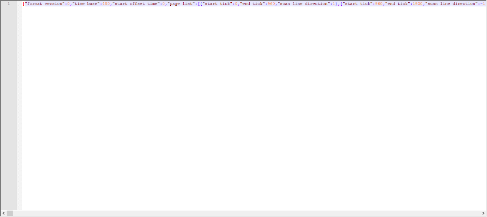
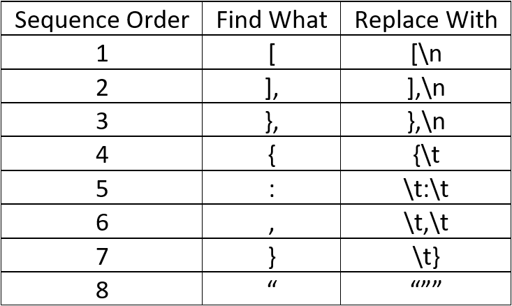
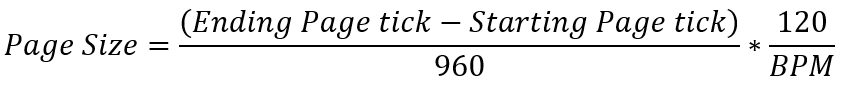

# Chart in other ways

## Excel Charting

### Introduction

Excel Charting, as what it's name states, charting using Excel program from Microsoft Office. Excel Charting is in essence, notepad charting, only just that because of its nature, Excel Charting more ideal for editing rather than creating from scratch.

This guide here is an extended reach after charting via PCTyx then converted to C2 format via Converter.

Excel charting is *not* recommended for new charters because it requires knowledge of notepad charting, which has very steep learning curve.

### Pros and Cons

Pros:

- Anything done in notepad charting, can be done in Excel Charting
- Capable of Dynamic Page Index. Which means notes page_index will dynamically change if you edit, delete, or add a page in the middle of the chart.
- You can edit en masse.
- Formula based calculations, let the slave work of calculating done by the computer.
- You can add "approach_rate" string en masse.
- You can split window in excel without any external plugins needed, which can make editing chart far more easier.

Cons:

- The importing procedure is still manual.
- Need to clear white space after Excel Charting is done so Online Board works (which is easy).

### Requirements

1. Basic knowledge of notepad charting. When I mean basic, I mean you understand what "**tick**" means and how it interacts with BPM and scanline, knows which arrays are page arrays and note arrays, and finally understand what is a **Page** itself in technical terms
2. Notepad++ or any notepad applications that support Extended 'Find and Replace'
3. Microsoft Excel (obviously)
4. Chart that has been converted to C2 format, ideally that comes from Mekko's Converter. Because the formulas listed here are based on the output of that software.

### Importing to Excel

Firstly, open your chart using Notepad++. You will see something that's hard to make sense similar to the image above.

Press CTRL+H. A Find and Replace Window will pop up. Set it up like the image next to this text.

Type [ in Find What box, and Type [\n in Replace With Box. Like image next to this.

Then click Replace All, or CTRL+A keyboard shortcut.

If you see your chart turns like this, you've done correctly.

Repeat the same procedures for each items below. Make sure to do them sequentially. If you follow this guide for first time, the first item is done just previously, which is Find [ and replace with [\n.

When it's done correctly you have something that looks like this.

Press CTRL+A to Select All, and press CTRL+C to Copy it. Then open Excel

In Excel, select cell B1, and press CTRL+V. Why Cell B1? Because A1 will be used for writing Page Index which is used for Dynamic Page Index later.

If you see image like above (no triple quotes, numbers are in their own cells, symbols are also in their own cells), then you've done it right.

BUT WAIT, there's something you have to check first.

In Excel, Press CTRL+H and search """

Then replace with "

Just like image next to this. Make sure to select Replace All.

Reason to do this is because Triple Quotes will cause error when you export this back to notepad later.

After you've done all this, you've successfully import the chart to Excel.

### Dynamic Page Index

To create Dynamic Page Index, first we have to generate the page index numbers itself. Go to Cell A1, and put something easy to identify, like "Page Index" without quotes.

To generate Page Index do it like the video below.

Make sure to generate them to the last of "start_tick" in cell C.

You have to redo this every time you add or delete a page.

<iframe width="560" height="315" src="https://www.youtube-nocookie.com/embed/IeGlITjocFA" title="YouTube video player" frameborder="0" allow="accelerometer; autoplay; clipboard-write; encrypted-media; gyroscope; picture-in-picture" allowfullscreen></iframe>

Then we go to our first Note page index cell, which is two columns to the right where "page_index" resides.

Then we have to change the value of the cell to this Formula:

`=INDEX($A, MATCH(B, $C, 1)`

In which case where:

- `$A` = Page Index Array you generated and set to Absolute.

- `B` = The note tick.

- `$C` = start_tick Array and set to Absolute.

Check Video below on how to do it.

<iframe width="560" height="315" src="https://www.youtube-nocookie.com/embed/vEB8sjyODzk" title="YouTube video player" frameborder="0" allow="accelerometer; autoplay; clipboard-write; encrypted-media; gyroscope; picture-in-picture" allowfullscreen></iframe>

Next step would be to just drag the formula down like video below.

<iframe width="560" height="315" src="https://www.youtube-nocookie.com/embed/yEXzGvVJdas" title="YouTube video player" frameborder="0" allow="accelerometer; autoplay; clipboard-write; encrypted-media; gyroscope; picture-in-picture" allowfullscreen></iframe>

Video on Dynamic Page Index at work:

<iframe width="560" height="315" src="https://www.youtube-nocookie.com/embed/l2oe3fgU80c" title="YouTube video player" frameborder="0" allow="accelerometer; autoplay; clipboard-write; encrypted-media; gyroscope; picture-in-picture" allowfullscreen></iframe>

### Exporting Back to Notepad

So let's say you've done your Excel Charting and want to copy back to notepad. It's simple. Just copy and paste back, but make sure to copy all but only the chart part. See video for detail. I color code my excel because for easy viewing, and color does not affect the content. I also color code edited pages and notes for easy remembering.

The video also shows how to easily delete white spaces.

The site to delete white spaces is [jsoneditoronline.org](http://www.google.com/url?q=http%3A%2F%2Fjsoneditoronline.org%2F&sa=D&sntz=1&usg=AFQjCNG2P92UzDMJwZhc-jBgrPCilgu3vQ)

<iframe width="560" height="315" src="https://www.youtube-nocookie.com/embed/gzC7KygoiQk" title="YouTube video player" frameborder="0" allow="accelerometer; autoplay; clipboard-write; encrypted-media; gyroscope; picture-in-picture" allowfullscreen></iframe>

### Tips When Editing

1. Color Codes the area you have to copy paste back to notepad for easy copy paste later.
2. Color codes the chart area you have edited.
3. Take advantage of split window feature in excel. This will make you less scrolling back and forth.
4. You only need to clear white space when you upload it to Cytoid.io. If still test playing or editing, you don't need to clear the white space.

### Extras

#### Approach Rate

Approach Rate is a string parameter that is exclusively used by Cytoid. It determines how early (or how late) a note appears in the screen before the note is played.

Having Approach Rate string in your chart does not affect the chart at all, in fact other C2 chart players will not see the approach rate strings at all.

Approach Rate strings have to be placed inside note object which is located in note array. See image below for example.

There is only one actual reason why you need to use Approach Rate, and that is you have done something that is not normal and thus the notes appears too late for players to react. Approach Rate string primary use is to fix this.

There are two approaches to well... approach rate. While the principle and how it works is essentially the same, how you fill the formula differs depending on the approach.

1. The first approach should be used if you modify scanline speed with the use of PCTyx BPM changing mechanic.
2. The second approach should be used if you modify scanline speed by modifying starting or ending page tick itself.

Before we go on, here is the basic "approach_rate" string formula.

- "approach_rate" = approach rate that will be input to our chart
- AR = Engine default approach rate
- Target BPM = The target BPM speed you wish your notes appear at.

BPM and "approach_rate" are kinda obvious, but the AR is not.

AR is the default approach rate used by the engine. We short it to AR as to differentiate our own approach rate with default engine approach rate. So this will be what I use:

- Default Approach Rate Engine = AR
- Our new approach rate = approach_rate.

To calculate AR we use this formula:

Page Size = The time it takes for scanline to reach from bottom to top or top to bottom for the page where the note is located on. There's two approach to this, see below.

Page Ratio = In which where the note is located relatively to the starting point of the page. In which case, starting page is 0, ending page is 1, the value is always will be between 0 and 1 (both ends inclusive). So if the note is at starting page, the page ratio is 0, if 1/4 from starting page to ending page, then the note ratio is 0.25, if the note is located halfway, then its 0.5.

Previous Page Size = Basically Page Size but for previous page.

If the above formula is confusing, you have to take it slow. This formula is the backbone to approach_rate.

Now this where the two approaches above matters.

The Page Size depends whether you use PCTyx to modify scanline speed (1st Approach) or modifying starting/ending page ticks via notepad or excel charting (2nd approach).

If you use 1st approach, the Page Size formula is simply:

But if you use the 2nd approach:

Note that 2nd approach cannot be used for previous page size if said previous page is used for scanline freeze (in which case where starting page tick is a very huge negative number).

If you manage calculate all of those, congratulations, you have managed to calculate approach rate for just *ONE NOTE*.

However, It's very, Very, VERY unlikely you will use approach_rate for just one note. Most likely, you have to calculate more than one page, and in one page there can be more than one note. This is a very tiring work.

You will most likely need to automate this via excel because of the nested formula of AR.

#### Approach Rate Automation

In this section, we will add "approach_rate" string to all notes. But doing things globally will make them simply more simple, except if there's any scanline freeze in the middle, you have to modify them yourself.

First we generate "approach_rate" string to all notes. See video below.

<iframe width="560" height="315" src="https://www.youtube-nocookie.com/embed/SZVTj7rxj4I" title="YouTube video player" frameborder="0" allow="accelerometer; autoplay; clipboard-write; encrypted-media; gyroscope; picture-in-picture" allowfullscreen></iframe>

Because of how heavily nested the AR formula can be, I heavily suggest to split the formula into multiple cells. Create some header like image below next to the end of copy paste area and in the same row at the start of note array.

The created headers are:

- Note ID. This is the same as note ID on the chart area, but copy pasted here for less horizontal scrolling.
- page_index. This is the same as note page_index, but copy pasted here for less horizontal scrolling.
- Current Note page start
- Current Note Page end
- Previous Page start
- Previous Page End
- Current BPM
- Page Size
- Page Ratio
- Previous Page Size
- AR

Formula for the inside of the headers:

Note ID = value of "id" in chart area

page_index = value of "page_index" in chart area
