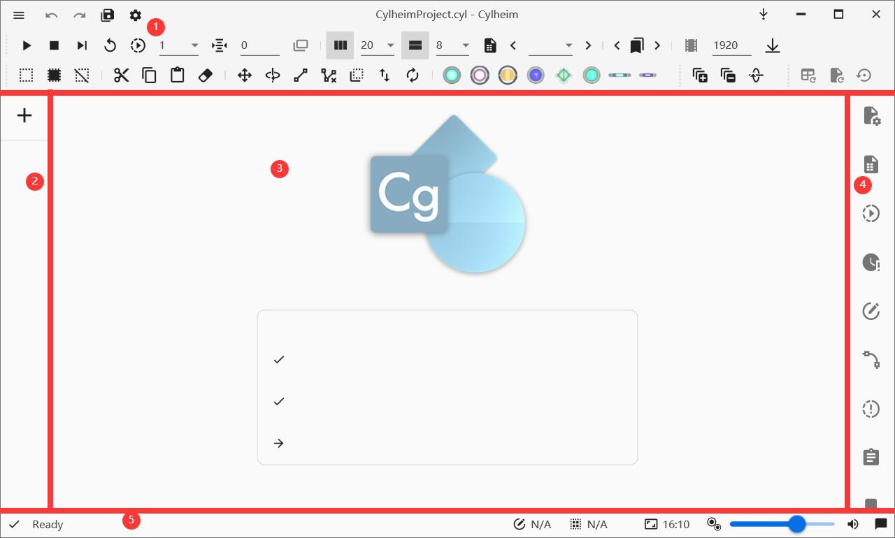
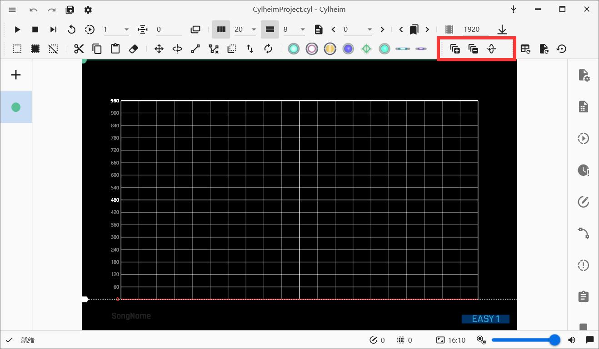

# 使用 Cylheim

我们有一个视频教程: [点我跳转](#视频教程)

## 安装 Cylheim

1. 前往 [Cylheim 的存储库](https://github.com/Horiztar/Cylheim-Windows/)

2. 在右侧找到 [Releases](https://github.com/Horiztar/Cylheim-Windows/releases)

3. 下载与你使用环境对应架构的压缩包或者**安装包(推荐)**. 如果你不知道要选什么, 可以试试下载x64的版本. 

::: tip 快速安装
我们建议你下载安装包, 这样你就可以像安装其他软件一样安装 Cylheim 了.
:::

安装 Cylheim 后, 你应该可以在桌面看到 Cylheim 的快捷方式, 双击即可启动 Cylheim.

如果Cylheim成功启动了, 你应该能看到这样的界面: 

::: tip 有点不同? 
为方便翻译为多语言版本, 这里使用了英文截图, 但是按钮的位置是基本一致的.
:::

## 准备制谱

在使用Cylheim制谱之前, 我们需要准备一些必要文件. 

1. Cylheim

2. 谱面的音频文件

::: tip 注意事项
这个音频文件必须已经对齐节拍线, 你可以在前面的篇章中学习到如何准备一个符合要求的音频文件. 
:::

在这次示例中, 将使用Yunomi的曲目: [夢色パレード (w/ 桃箱 & miko)](https://iamyunomi.bandcamp.com/track/w-miko-6)

> PS: 这首曲目通过CC BY-NC-SA 3.0发布, 同时也是本文使用的分享协议

<!-- [已经对齐节拍线的音频文件可以在这里下载到]() -->

为了方便进行谱面管理, 推荐为每一首曲目都创建一个单独的文件夹. 就像这样:

准备完成后, 就可以开始学习制谱了

## 开始制谱

### 新建项目

打开 Cylheim 以后, 你可以看到这样的界面

点击 **New Project**, 找到你放置音频文件的文件夹, 点击保存

### 认识UI

完成新建项目的工作后, 我们先来认识下UI界面

#### 1. 工具栏&标题栏

将鼠标悬浮于图标上即可获知按钮信息.

#### 2. 谱面列表

用于管理谱面, 点击`+`添加谱面.

#### 3. 设计器

放置 Note 的主要区域

#### 4. 侧边工具栏

用于对谱面进行高级操作

#### 5. 状态栏

从左到右依次是: Cylheim 状态, 谱面总 Note 数量, 已经选择的 Note 数量, 音符大小控制器, 音量控制器, 通知

### 新建谱面

点击谱面列表中的`+`, 进入新建谱面界面.

界面被分割线分割为四个部分, 从上到下的分区功能依次是 **导入谱面**, **谱面基本信息**, **设计器外观**, **设计器外观模板**

在此, 我们仅需要填写谱面基本信息, 即**谱面文件名**, **音频文件位置**, **起始BPM**

> 长度将会在选择音频文件后自动测量, 无需手动填写. 

我们要制作这首歌的 Easy 难度, 因此我们需要输入谱面文件名 **Easy.json**, 选择音频, 填入这首歌的BPM`160`.

点击**创建**, 谱面就新建完成了

### 基本操作

Cylheim 的基本操作非常符合逻辑

#### 了解基本快捷键

你可以在**设置**-**快捷键**了解更多快捷键, 或更改为合符自己操作习惯的快捷键

| 快捷键名称         | 默认快捷键          |
| ------------------ | ------------------- |
| 播放 / 停止播放    | Space               |
| 停止播放并留在此页 | Ctrl + Space        |
| 撤销               | Ctrl + Z            |
| 重做               | Ctrl + Y            |
| 复制               | Ctrl + C            |
| 粘贴               | Ctrl + V            |
| 剪切               | Ctrl + X            |
| 删除               | Delete              |
| 加选本页 Note      | Shift + A           |
| 仅选本页 Note      | Ctrl + A            |
| 选择全部 Note      | Ctrl + Shift + A    |
| 跳转到上一页       | 鼠标滚轮 / PageUP   |
| 跳转到下一页       | 鼠标滚轮 / PageDown |

#### 放置 Note

Cylheim 将放置 Note 的方式全部集中在了鼠标, 这意味着你只需使用这些合符逻辑的鼠标动作, 即可轻松放置 note. 

##### 放置 Click

只需在需要放置的位置, 轻击**鼠标左键**

##### 放置 Hold / Long Hold

在 Hold 的起始位置按下**鼠标左键**, 并拖拽到 Hold 的 结束位置, 松开**鼠标左键**. 

::: tip 小提示: 放置跨页 Hold
在按住**鼠标左键**时, 可以使用快捷键, 转到其他页面, 将 Hold 延长到另一页

Hold 跨页时, 会被自动转为 Long Hold
:::

##### 放置 Flick

在需要放置 Flick 的位置按下**鼠标左键**, 向左/右拖拽一定距离(直到看到 Click 图标变成 Flick), 然后松开**鼠标左键**

##### 放置 Drag

在需要放置 Drag 的位置按下**鼠标右键**, 拖拽到需要放置子 Drag 的位置, 按下**鼠标左键**. 

继续拖拽并按下**鼠标左键**可以放置更多子 Drag. 

松开鼠标右键结束放置.

::: tip 小提示: 连接与拆分锁链
可以使用工具栏的**连接 Drag 音符**功能, 将两条锁链连接起来.  
也可以选中锁链的两个节点, 使用工具栏的**断开 Drag 音符**功能, 将锁链拆分. 
:::

::: tip 小提示: 延长锁链
选中锁链/锁链的其中一个节点, **鼠标右键**拖拽选中的节点, 可以为该锁链添加更多节点.
:::

::: tip 小提示: 放置跨页锁链
在按住**鼠标右键**时, 可以使用快捷键, 转到其他页面继续放置锁链
:::

#### 线速变化

Cylheim 为标准 C2 格式设计. 因此针对变速, Cylheim 提供了两种方案

##### 更改页长

Cylheim 为倍速 / 半速提供了便捷操作的按钮

此外, 你也可以打开**侧边工具栏**-**页面管理**, 对页面长度进行编辑

::: tip 不知道如何编辑页面?
请阅读[Cytus II 谱面格式详解](/zh/charting/chart-json), 了解 C2 格式
:::

##### 更改 BPM

::: warning 使用规范
请在更改页长无法完成预期行为, 或曲目 BPM 存在变更时使用 BPM 变速
:::

可以在**侧边工具栏**-**速度管理**编辑速度列表

::: tip 修改已有速度
发现初始 BPM 有误? 需要更改一个已经存在的 BPM?  
在相同 tick 的位置添加速度即可更改
:::

::: tip 修改速度列表后, 将已有元素对齐
修改速度列表后, 原有的谱面元素(分页点, Note, 事件, 谱面长度)可能产生时间偏移, 可以选择将这些元素保持在原来的时间上. 
:::

#### 生成事件

当谱面的线速存在变化时, 往往需要添加 **speed up** 和 **speed down** 这些变速提醒.

使用快捷键 **Ctrl + E**, 快速生成这些需要的事件

#### 设置播放速度

你可能需要调整播放速度, 以听出更准确的节拍信息

::: tip 使用更精确的变速方式
在**设置**-**音频**中, 打开**通过调整采样率改变播放速度**. 可以大大提升慢速播放的准确度. 

但是, 这种改变速度的方式, 会导致慢速时音频声调变低...
:::

## 发布谱面

### 录制预览视频

Cylheim 内置了播放器, 在工具栏中寻找**独立预览模式**按钮以启动播放器

请使用录屏软件进行录制, 我们推荐[OBS Studio](https://obsproject.com/download).

::: tip 正在使用性能较差的设备?
如果受到条件限制, 不得不使用性能较差的设备录制预览视频时, 我们有几种方法助您减少卡顿.
1. 使用较低的分辨率进行录制
2. 使用慢速录制, 通过剪辑软件进行加速
3. 尝试减少其他程序的 CPU 占用 (Cylheim的独立预览需要CPU性能)
:::

### 打包成 CytoidLevel

Cylheim 内置了 CytoidLevel 打包, 可以将谱面导出为 Cytoid 关卡

在 Cylheim 左上角进入菜单后, 选择 **导出 Cytoid 关卡**

根据提示, 填写关卡信息, 关卡谱面即可完成打包. 

::: tip 添加 Storyboard?
Cylheim 为添加 Storyboard 提供了支持, 可以在打包时将 Storyboard 一并打包. 
:::

## 视频教程

<BilibiliPlayer
  aid="798679631"
  bvid="BV1Ly4y1m7Np"
  cid="283509706"
/>

