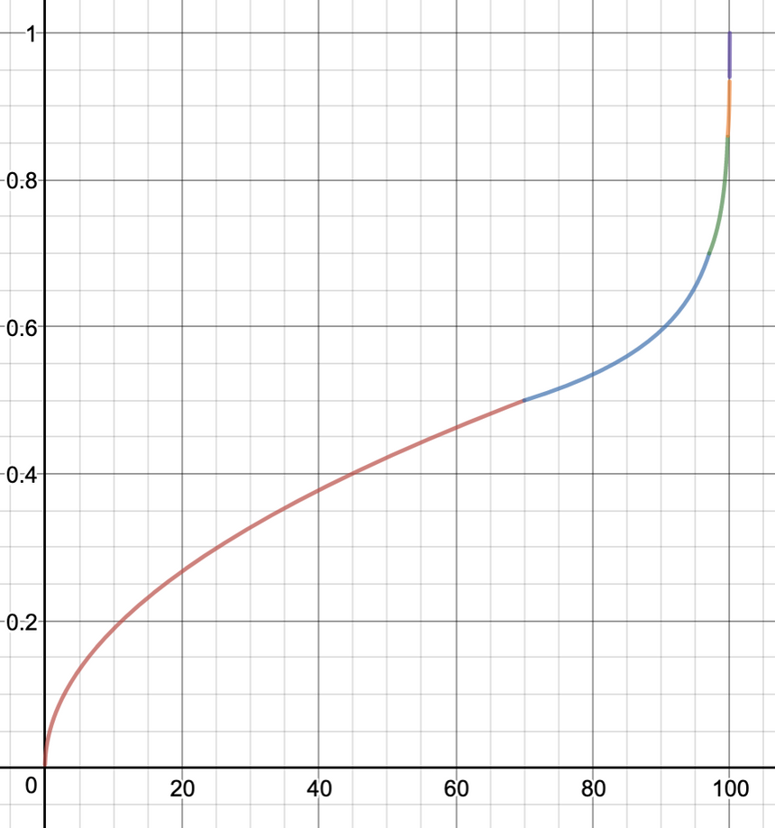

# {{$frontmatter.title}}

Cytoid 的玩法很简单, 您只需要配合音乐与谱面在对应的时机击中屏幕上出现的 Note 来获取高分.

## Note 类型

Cytoid 中的 Note 有如下几类:

### 单点 Click
- 当扫描线扫过 Note 时点击即可.

### 侧滑 Flick
- 当扫描线扫过 Note 时点击并向任意一侧滑动即可.
- 没有 Good / Bad 判定.
- 如果没有点击动作只是滑过, 或者只是点击没有滑动动作, 都不进行判定.

### 长条 Hold
- 当扫描线扫过 Note 头部时长按直到当扫描线扫过 Note 尾部或 Note 外的指示圈满后即可.
- Hold 长条首尾可以在一屏内, 也可以跨屏, 跨屏长条一般称为 Long Hold 或黄条.
- 只要在判定窗口之内一直按着就可以得到 Perfect, 所以提前按下或者延后松开也没有关系.

### 锁链 Drag
- 当扫描线扫过每个节点时手指在判定区域内滑过 (或点击) 即可.
- 每个节点各算一个连击数, 成功清除即为 Perfect 判定, 所以提前滑到也没有关系, 但是提前太多会打乱节奏.

### 点锁 C-Drag
- 当扫描线扫过首个节点时点击, 之后节点在判定区域内滑过 (或点击) 即可.
- 首个节点的判定方式同 Click, 只是滑过不判定.
- 之后节点判定同 Drag.

想要在实际操作中练习一下? 请尝试游戏中内置的 Tutorial 谱面, 该谱面的两个难度分别对应着基础和进阶的玩法教学.

## 游戏模式

### 自由

一般的 Cytoid 游玩模式, 您可以自由选择已下载的官方谱面和社区谱面进行游玩.

### 活动

在此处参与不定期举办的活动, 游玩活动歌曲并挑战活动段位.

活动中达成的段位会显示在游戏内的玩家资料卡中.

### 训练

在此处游玩官方训练谱面, 提升 Cytoid 技巧.

同时, 您也可以在此处向 Kaede 询问 Rating 分析和建议.

### 段位

在此处进行段位考核, 获取奖励角色和谱面.

段位考核需要连续游玩 3 个曲目, 并满足一定的过关要求 (例如精准度、连击等). 玩家在游玩谱面途中 __不可暂停__, 但每个曲目结束后的结算界面有最多 30s 的休息时间. 通过后的段位会显示在游戏内的玩家资料卡中.

截至 2.0.2 版本, 游戏中共有 6 个段位. ~~之后的段位在做了在做了~~

## 判定模式与计分规则

在 Cytoid 社区的相关讨论中, 您或许会经常听到“R 判”或者“Ranked”这类术语, 它们是 1.x 版本时期对现版本默认判定模式 __排名模式__ 的一种称呼. 相应地, 之前版本的默认判定模式 (U 判, Practice / Unranked) 在 2.0 版本中称为 __练习模式__ ~~dd 模式~~.

为了方便起见, 下文中“R 判”均指排名模式,“U 判”均指练习模式.

两种判定模式的区别如下:

- 游戏玩法: R 判的判定区间比 U 判严格, 计分方式也有所不同.
- 成绩上传: R 判下的游戏成绩会上传到服务器, 并记录到您的最近游玩记录当中, 且每个谱面难度在 R 判下打出的个人最佳记录可在您的多个设备上同步, 并进入排行榜参与排名. U 判下每个谱面难度的最佳记录保存在本地, 不进行同步.
- 经验值: 无论使用何种判定模式都会获得经验值, 但相同条件下 R 判获得的经验值是 U 判的两倍.
- Rating: 只有 R 判下的游玩记录会影响 Rating.

您可在谱面难度选择页面右上角的手柄菜单中切换判定模式.

### 判定区间

U 判和 R 判的游戏玩法完全相同, 区别只在于 __判定区间和计分方式__.

两种判定模式的具体判定区间参阅下表 (单位: ms, 越正越迟, 反之越早):

|判定模式|Perfect (蓝) |Great (黄) |Good (绿) |Bad (红) |Miss (灰) |
|:---:|:---:|:---:|:---:|:---:|:---:|
|Unranked|±70|-200 / +150|-400 / +200|-800 / +300|X|
|Ranked|±40|±70|-200 / +150|-400 / +200|X|

当然, 一般情况下, 您只需要记住: __R 判下的所有判定区间都比 U 判严格一个等级__ 就可以啦!

### 计分方式

分数表示着玩家在游玩中的粗略表现 (含连击表现). 无论采用何种判定模式, 满分均为 1,000,000 分 (即 All Perfect MAX), 其余评价级别对应的分数段如下表:

|评级|MAX|SSS|SS|S|AA|A|B|C|D|F|
|:---:|:---:|:---:|:---:|:---:|:---:|:---:|:---:|:---:|:---:|:---:|
|分数段|1,000,000|999,000+|995,000+|990,000+|950,000+|900,000+|800,000+|700,000+|600,000+|600,000-|

#### 练习模式

U 判的计分方式包括 900,000 分的判定分和 100,000 分的连击分. 结算时两部分得分四舍五入至整数后相加.

判定分 __平均分配__ 给每个 Note, 清除 Note 时根据判定结果获得该 Note 的判定分百分比按下表计算:

|判定结果|Perfect / Great|Good|Bad|Miss|
|:---:|:---:|:---:|:---:|:---:|
|判定分 %|100%|70%|30%|0%|

连击分按照当前连击数以 __等差数列__ 的方式进行叠加. 设谱面物量 (即 Note 总数) 为 N, 则将连击分均为 (N * (N + 1) / 2) 份, 在清除每个 Note 时若当前连击数为 C 则将 C 份连击分叠加到总分上, 若断连则 C 归零.

#### 排名模式

R 判的计分方式使用一种特殊算法, 总的来说, 这种算法与连击数 __也存在关联__, 但这一关联比 U 判更弱.

该计算方法将 1,000,000 分的满分 __平均分配__ 给每个 Note 作为各自的 __基准分__, 清除 Note 时根据判定结果获得该 Note 的基准分百分比按下表计算:

|判定结果|Perfect|Great|Good|Bad|Miss|
|:---:|:---:|:---:|:---:|:---:|:---:|
|基准分 %|100%|90% ~ 99.99%|50%|10%|0%|

其中, Great 判定的基准分比较特别, 它并非简单的固定百分比, 而是和相对打击偏差成 __线性相关__, 打击偏差越大, 获得的基准分越少.

决定每个 Note 的得分还有另一个关键值, 在此暂且称它为得分系数. 它的取值在 0 ~ 1 之间, 初始值为 1, 每个 Note 判定后根据结果对其作出以下改动:

|判定结果|Perfect|Great|Good|Bad|Miss|
|:---:|:---:|:---:|:---:|:---:|:---:|
|变化量|+0.004C|+0.002C|+0.001C|-0.025C|-0.05C|

其中, C 为一个常数, 它的值为 (该谱面物量的算术平方根 / 3).

每个 Note 的基准分和得分系数计算完毕后, 将两部分相乘, 再叠加到总分上.

结算时, 由于计分系统可能存在的精度问题, 对最终的分数再做出如下补正:
- 分数计算值大于 1,000,000 按 1,000,000 计.
- 分数计算值大于 995,000 且 AP 按 1,000,000 计.
- 分数计算值为 1,000,000 但未 AP 按 999,999 计.

### 精准度计算方式

精准度代表着玩家在游戏中更加精细的准确度情况, 采用百分比表示. 无论采用何种判定模式, 最高值均为 100% (即完美精准度 / 收歌 / 杀歌 / ~~MGA TANGA!!~~), 显示时保留两位小数.

#### 练习模式

U 判中, 单个 Note 的精准度按下表计算:

|判定结果|Perfect|Great|Good|Bad / Miss|
|:---:|:---:|:---:|:---:|:---:|
|精准度|100%|70%|30%|0%|

总体的精准度计算方式为每个 Note 的精准度 __取平均值__.

#### 排名模式

R 判中, 单个 Note 的精准度按下表计算:

|判定结果|Perfect|Great|Good|Bad / Miss|
|:---:|:---:|:---:|:---:|:---:|
|精准度|100%|70% ~ 99.99%|30%|0%|

和分数类似, Great 判定获得的精准度也和相对打击偏差成 __线性相关__, 打击偏差越大, 获得的精准度越少.

总体的精准度计算同样为每个 Note 的精准度 __取平均值__.

### Rating 计算方式

::: tip
本段部分摘录自官方说明[《Rating 和你》](https://www.bilibili.com/read/cv6536670)以及 [Notion](https://www.notion.so/Rating-System-509becb063954a699d1be1fc82eecd70) 上的解说.
:::

Rating (rt) 是用于展现玩家实力的数值.

每次使用 R 判游玩一张谱面并提交成功后, 游戏会计算一份 __单曲 Rating__, 并记录在您的档案库中, 用于计算您的 __整体 Rating__.

它们的计算方式如下:

> 单曲 Rating = 表现评分 (与精准度有关)  * 谱面等级
>
> 整体 Rating = (最高的 30 个单曲 Rating + 最近 60 天中最高的 10 个单曲 Rating) / 40
>
> 表现评分 y 的计算按照与精准度 x 有关的如下分段函数:
> $$y=
\begin{cases}
 & 0.5\sqrt{\frac{x}{70}} \text{, } 0 < x < 70 \\
 & 0.7-0.2\log_{10}{(\frac{100-x}{3})} \text{, } 70 \leqslant x < 97 \\
 & 0.7-0.16\log_{10}{(\frac{100-x}{3})} \text{, } 97 \leqslant x < 99.7 \\
 & 0.78-0.08\log_{10}{(\frac{100-x}{3})} \text{, } 99.7 \leqslant x < 99.97 \\
 & 2x-199 \text{, } 99.97 \leqslant x < 100
\end{cases}$$
> 不想看到这么复杂的函数式? 画成图像大概长这样:
> 

<!--
LaTeX Source:
y=
\begin{cases}
 & 0.5\sqrt{\frac{x}{70}} \text{, } 0 < x < 70 \\
 & 0.7-0.2\log_{10}{(\frac{100-x}{3})} \text{, } 70 \leqslant x < 97 \\
 & 0.7-0.16\log_{10}{(\frac{100-x}{3})} \text{, } 97 \leqslant x < 99.7 \\
 & 0.78-0.08\log_{10}{(\frac{100-x}{3})} \text{, } 99.7 \leqslant x < 99.97 \\
 & 2x-199 \text{, } 99.97 \leqslant x < 100
\end{cases}
Thanks to https://www.codecogs.com/latex/eqneditor.php
-->

以下是该套计算公式的补充说明:

- ? 难度的谱面不参与 Rating 计算.
- 对于同一谱面 ID, 不同难度的单曲 Rating 分别计算.
- 谱面等级的取值为 1 ~ 16, 对应谱面的难度等级 (16 对应 15+) . 因此, 单曲和整体 Rating 的最大值均为 16.
- 用于计算“最高的 30 个单曲 Rating”的谱面 ID (同一难度) __不可重复__.
- 用于计算“最近 60 天中最高的 10 个单曲 Rating”的谱面 ID (同一难度) __可以重复__.
- 在计算整体 Rating 时, “最近 60 天中最高的 10 个单曲 Rating”会进行 __浮动改动__.
  - 在距离结算时间的 0 ~ 30 天内, 它不会有任何改变.
  - 在随后的 30 ~ 60 天内, 它会额外乘以一个线性参数, 从 1 逐渐降为 0.
  - 这意味着, 如果您超过一个月没有进行任何游玩, 你的 Rating 就会开始持续下降, 直到上述公式中的“最近 60 天中最高的 10 个单曲 Rating”归零为止.
  - 同时, 只要你在一个月内保持活跃 (10 次游玩以上) , 你的 Rating 就 __不会下降__. 所以, 记得常来 Cytoid 玩!

您可以在游戏内查看 Rating 的全球排行榜. 此外, 您可以登入 Cytoid 官网, 进入 __工作室 > Cytoid 分析__ 页面, 查看 Rating 计算明细.