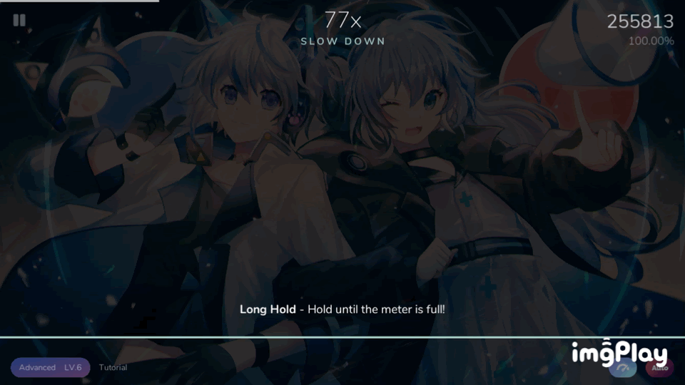

# Note types

- There are 6 note types in Cytoid, they're: Tap, Drag, C-Drag, Hold, Long hold, Flick.

### Click

You just have to tap whenever the inner colored circle is close to the outer ring.

### Drag

Simply slide along the line through the small circles. You don't need to wait for the scanner, but don't drag too far ahead because you might mess up your rhythm.

### C-Drag

- This is a "hybrid note" of Click and Drag.
- Its "drag head" has click note's mechanics. That means you have to touch when the scanner reaches it, then slide your finger along the line with connecting notes.

### Hold

Have your finger on the circle before the scanner has reached it. Hold it there until the scanner has gone to the end of the line coming out of the circle. You don't need to release it. You also don't need to tap it like the click note, so you can slide onto it like a drag note.

### Long hold

A variant of the hold note. You usually need to hold your finger longer than a page. You can see how long you need to hold if you look at the pulsing ring around the circle.

### Flick

A different version of click notes. You need to tap and slide away from it horizontally.
