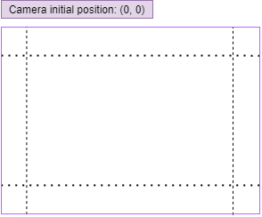

# StoryBoard 完整规格

**版本: 2.0.2**

本说明详细讲解了StoryBoard的相关规格; 您可以以此为参考, 但我们强烈建议您在开始制作StoryBoard前**阅读整个文档**, 以了解StoryBoard的功能和局限性.

***在下方下载Cytoid Player!***

[CytoidPlayer 2.0.2.zip](https://drive.google.com/file/d/1skBP8u_LTDloTxXr3cVl8YdJzmgMkywi/view?usp=drivesdk)

## 🌟 坐标系

- 在我们开始制作 storyboard 前, 让我们先了解游戏中的不同画布和坐标系:
    - 在**storyboard** 中, **sprites**, **texts** 和 **stage**会使用一个 800 (宽) * 600 (高) 的直角坐标系. 如图, 这个坐标系的中心是(0, 0), 右上角是 (400, 300), 左下角是 (-400, -300).
        - 这个坐标系的 X 轴和 Y 轴 被称为 `stageX` 和 `stageY`.
    - **notes** 的坐标系和谱面相同. 如图, X/Y的坐标范围应为 [0, 1], 其中, (0, 0) 是该坐标系的左下角.
        - 这个坐标系的 X 轴和 Y 轴 被称为 `noteX` 和 `noteY`.

    .png)

    - 游戏内的 **camera**(相机) 有他自己基于 [orthographic size(正交尺寸)](https://docs.unity3d.com/ScriptReference/Camera-orthographicSize.html) 的坐标系. 默认情况下, 相机位于 (0, 0).
        - 这个坐标系的 X 轴和 Y 轴 被称为 `cameraX` 和 `cameraY`.

        

        .png)

    - 最后, 游戏中还有一个 **Z 轴**, 用于处理3D坐标中的深度. 您无需关注这个坐标轴, 除非您在 `scene controller` 中,将 **perspective** 选项调至 `true`.
        - 请注意, 相机默认朝 Z 轴的正方向观察, 它的默认位置为 Z = -10. 设置一个像 Z = -8 的值会使相机靠近 notes, 设置一个像 Z = -15 的值会使相机远离 notes.
- 你可以像这样 **进行坐标系之间的转换**: `[coordinate system(原坐标系)]:[value(值)]`.
    - 例如, 您创建了一个 sprite, 想让它显示在note区域的最左侧底部, 正好位于在note 坐标系中的(0, 0). 但是, 这里需要的 `x` 和 `y` 是基于 stageX 和 stageY 的坐标系的, 这时就需要转换坐标系.
        - 在 Cytoid 2.0.0 引入坐标系转换之前, 通常计算屏幕宽高比来判断note区域的对应坐标. 这就要求 storyboard制作者要面向不同的屏幕比例创建不同的谱面 (就像 [这个谱](https://cytoid.io/levels/tigertiger.deadsoul)), 也没有考虑到玩家可以修改游玩区域大小 (通过相应设置).
        - 从 Cytoid 2.0.0 开始, 我们可以使用坐标系转换来表示实际坐标, 如下所示:

            ```json
            {
              ...
              Sprite 定义
              ...
              "x": "noteX:0",
              "y": "noteY:0"
            }
            ```

            StoryBoard在游戏中加载以后, Cytoid 会自动计算实际的 `x` 和 `y` 的值--无需探究无聊的技术细节, 你只需要知道 sprite 会显示在note坐标系中的 (0, 0)! (如你所愿!)

    - 一个更实际的问题: 如何将sprite拉伸为正方形, 并且使其顶部和底部与屏幕边界对齐?
        - 一个天真~~naive~~的尝试:

            ```json
            {
              ...
              Sprite 定义
              ...
              "preserve_aspect": false, // 允许 sprite 变形
              "width": 600,
              "height": 600
            }
            ```

            不幸的是, 这可能不会像想象中那样运行: 它不一定会渲染成一个正方形. 实际上, 只有屏幕比例为 4:3 的设备才会将其渲染为正方形. 回想一下,在**任何设备**上, stage 的坐标系大小均为 800 * 600, 因此 stageX 中的一个单位不一定等于 stageX 中的一个单位.

            - 简而言之, 当我们将一个 sprite 的 `width` 和 `height` 都设置为 600, 实际上 sprite 占据了屏幕宽度的 600/800 = 3/4, 屏幕高度的600/600 = 全部. 因此, 要使其成为正方形, 屏幕宽度的3/4必须等于屏幕高度, 这样就能强制实现 4:3 的屏幕比例. 
        - 为了使正方形与屏幕的上下边界对齐, `height` 的值必须为 `600`; 问题是我们该如何给 `width` 赋值. 因此, 我们 **只需要将 `stageX` 转换为实际长度相同的 `stageY`**. 怎么做? 只需像下面这样使用坐标转换...

            ```json
            {
              ...
              Sprite 定义
              ...
              "preserve_aspect": false,
              "width": "stageY:600",
              "height": 600
            }
            ```

            就是这样! 我们委托 Cytoid 计算 `stageY:600` 的实际长度, 并将这个实际长度转换为 `stageX` 的值. 无论实际长度是多少, sprite 总是被渲染成一个正方形.

    - 最后, 您不太可能需要转换深度(Z 轴)坐标, 因为这没有数学意义. 但是您随时可以尝试! 😇

## 根对象

- **texts**: 文本对象组.
- **sprites**: sprite 对象组.
- 🌟 **lines**: line 对象组.
- 🌟 **videos**: 视频对象组. **试验性!**
- **controllers**: 场景控制器对象组.
    - 通常只需要一个控制器来控制整个场景, 但是如果您需要定义动画状态重叠的效果, 则多个控制器会派上用场. 对于初学者, 建议只使用一个控制器. 
- 🌟 **note_controllers**: note控制器对象组.
- **templates**: **模板**对象组.

**基本状态** (所有对象的默认状态)

- 🌟 在故事板中, 我们一般把对象划分为两类: 出现在场景中的**sprites** (例如文本, 素材, 线条和视频), 和无场景内实体的**controllers** (场景控制器和音符控制器)
- 状态控制着对象在不同时间的行为。撰写状态时, 不需要在物体实例化的每一帧都添加状态, 只需要在关键帧写状态即可。
- 假设需要做一个在第0秒到第3秒从场景底部飞到屏幕中央的标题文字。逻辑上讲, 在这个区间里面的标题场景对象有无穷多的状态, 因为每个瞬间的位置都不一样。但是, 关键状态只有两个: 1. time为0时标题场景对象在底部; 2. time为3时标题场景对象在中央。故事板会自动根据你所填写的关键状态进行补间动画。
- 每个被声明的对象都至少有一个状态, 即初始状态。你可以在`states`集合中自定义额外的状态。

- **id**: 对象的唯一识别码(字符串). 如果没有被手动定义, 则将会被自动分配随机的数字与字母混合的ID. 支持使用`$note`的占位符 (见音符控制器部分).
- 🌟 **target_id**: *只可使用于场景对象。* 当 `target_id` 被设置为任何对象的id时, 这个对象不会拥有自己的实体但会控制`target_id`所指向的目标实体。支持使用`$note`的占位符 (见音符控制器部分).
    - 这有助于您 **创建状态重叠的动画**. 例如, 如果您想要以弧线为轨迹移动sprite, 使用单个场景对象几乎不可能做到这一点. 但现在, 您只需要以两个不同的缓动状态叠加, 首先以一种缓动状态 (例如`linear`) 让精灵沿着 X 方向运动, 并且让他沿着 Y 轴以另一种方法缓动 (例如`easeOutQuad`). 如下所示:

        ```json
        {
        	"id": "sprite",
        	"path": "dot.png",
        	"time": 0,
        	"x": 0,
        	"easing": "linear",
        	"states": [
        		{
        			"time": 5,
        			"x": 200
        		}
        	]
        },
        {
        	"target_id": "sprite",
        	"time": 0,
        	"y": 0,
        	"easing": "easeOutQuad",
        	"states": [
        		{
        			"time": 5,
        			"y": 200,
        		}
        	]
        }
        ```

    - 还有另外一种用法: 简化复杂状态. 假如您要将一个text的状态进行如下修改: `t=0` 到 `t=5` 执行位移, 并在 `t=2.5` 到 `t=7.5` 修改透明度, 以前您需要手动计算四个关键帧的状态. 
    - 请注意, target_id 所指对象必须与其属于同一种对象. 例如, 您不能将 sprite 的 target_id 设置为 text 的 id.
- 🌟 **parent_id**: *仅适用于 texts和 sprites.* 当 `parent_id` 设置为某个其他对象的 ID 时, 前者成为后者的子对象, 子对象的坐标系将会以父对象为原点(参考系), 即子对象将会跟随父对象进行运动. 支持使用 `$note` 占位符 (详情请参阅 note 控制器部分).
    - 例如, 您可以设置 sprite A 的 parent_id 为 sprite B 的id, 这样就能让 sprite A 跟随 sprite B 移动. sprite A 的任何运动都以 sprite B 的坐标为原点.
    - 另一个有趣的实验是将 sprite 的 parent_id 设置为一个 note controller 的 id. 由于 note controller 的位置为 note 的实际位置, 因此这个 sprite 会跟随 note 移动.
        - *但是, 您还不能用它创建自定义 note 皮肤.* 更多详情请见 "note controller" 部分.
- **time**: 该对象的基准时间, 以秒为单位. 要注意的是, 这个时间可能不等于实际时间, 请阅读下文查看计算对象确切时间的方法.
    - **如果一个场景对象 *(例如 text 和 sprite)* 没有设置 `time`, 这个场景对象将不会被启用, 除非这个场景对象被 trigger 启用.** *~~可是trigger被删了~~*
    - 如果值为以下格式之一, 则将自动进行替换. 请注意引号是必需的. `<Note ID>` 支持以 `$note` 在 note_controller中表示当前note (详情请见 note controller 部分).
        - `"start:<Note ID>"`: 选中 note 的时刻(如果是Hold/Long Hold, 则为其开始时刻)
        - `"end:<Note ID>"`: 选中 note 的结束时刻(用于Hold/Long Hold, 如果用于其他note效果同start)
        - `"intro:<Note ID>"`: 指定 note 出现时刻 (即 note 开始淡入的时刻)
        - `"start:<Note ID>:<Offset>"`: 选中 note 的时刻 + `<Offset>` (以秒为单位, 可以为负数)
        - `"end:<Note ID>:<Offset>"`: 选中 note 的结束时刻 + `<Offset>` (以秒为单位, 可以为负数)
        - `"intro:<Note ID>:<Offset>"`: 指定 note 开始淡入的时刻 + `<Offset>` (以秒为单位, 可以为负数)
        - 🌟 `"at:<Note ID>:<Percentage>"`: *仅用于Hold/Long Hold.* 选中note的开始时刻 + (选中 note 的结束时刻 - 选中note的开始时刻) * `<Percentage>`*(用于选取 hold 在某个百分比下的状态)*
            - 当 `<Percentage>` 为 `0`, 等同于 `start`
            - 当 `<Percentage>` 为 `1`, 等同于 `end`
    - 可以用列表来创建多个相同的状态. 例如:

        ```json
        "states": [
        	{
        		"template": "pulse",
        		"time": ["start:57", "start:123", "start:153"]
        	}
        ]
        ```

        会自动编译成

        ```json
        "states": [
        	{
        		"template": "pulse",
        		"time": "start:57"
        	},
        	{
        		"template": "pulse",
        		"time": "start:123"
        	},
        	{
        		"template": "pulse",
        		"time": "start:153"
        	}
        ]
        ```

- **relative_time**: 相对于父状态的相对时间. 例如,

    ```json
    {
    	"time": 5,
    	"states": [
    		{
    			// State A
    			"relative_time": 2.5
    		}
    	]
    }
    ```

    状态 A 的时间为 `5` + `2.5` = `7.5`.

- **add_time**: 到最后一个状态的相对时间. 例如,

    ```json
    {
    	"time": 5,
    	"states": [
    		{
    			"relative_time": 2.5
    		},
    		{
    			// State B
    			"add_time": 3
    		}
    	]
    }
    ```

    状态 B 的时间为 (`5` + `2.5`) + `3` = `10.5`.

- 计算对象准确时间的运算顺序:
    - 如果定义了 `add_time`: 最后定义的姿态的时间 + `add_time`
    - 如果定义了 `relative_time` ,同时也定义了 `time`: `time` + `relative_time`
    - 如果定义了 `relative_time` ,同时存在一个父状态: 父状态的时间 + `relative_time`
    - 如果定义了 `relative_time`, 但是没有父状态: 当前游戏时间 + `relative_time` **(注意: 仅用于 trigger)**
    - 如果 `add_time` 和 `relative_time` 都没有定义: `time`
- **easing**: 在状态的动画中使用缓动调整加速度. 访问 [https://easings.net/](https://easings.net/) 了解更多. 默认为 `linear` (线性).
- **destroy**: 如果设置为 `true`, **当对象完全过渡到本状态时**, 将会销毁这个对象. 为了提高性能, ***强烈建议*** 您销毁不再需要使用的对象.
    - 下面是一个触发器的使用示例, 当点击id为4的note时,将会生成并显示 `Hello world!` 文本, 并淡出消失*(不透明度为0)*, 最后文本被销毁.

        ```json
        ...	
        	"texts": [
        		{
        			"id": "hello_world",
        			"text": "Hello world!",
        			"size": 80,
        			"opacity": 1,
        			"states": [
        				{
        					"opacity": 0,
        					"relative_time": 0.5,
        					"destroy": true
        				}
        			]
        		}
        	],
        	"triggers": [
        		{
        			"type": "noteClear",
        			"notes": [4],
        			"spawn": ["hello_world"]
        		}
        	],
        ...
        ```

- **states**: 存储对象额外状态的列表.
    - 您可以在列表内再次定义状态, 该状态将被附加到父对象. 例如:

        ```json
        {
          ...
        	定义对象(省略)
        	...
        	"states": [ // 父对象定义的状态
        			"template": "stateA",
        		},
        		{
        			"states": [ // 内部状态中定义的状态
        				{
        					"template": "stateB"
        				},
        				{
        					"template": "stateC"
        				}
        			]
        		},
        		{
        			"template": "stateD"
        		}
        	]
        }
        ```

        等同于

        ```json
        {
          ...
        	定义对象
        	...
        	"states": [
        		{
        			"template": "stateA",
        		},
        		{
        			"template": "stateB"
        		},
        		{
        			"template": "stateC"
        		},
        		{
        			"template": "stateD"
        		}
        	]
        }
        ```

        这对一次使用多个状态很有用. 请参阅后文中的 `pulse` 模板.

**场景对象状态** (适用于 text, sprite, video 和 line)

- **x**: 对象的 X 坐标. 默认为 `0`. 默认坐标系为 stageX.
- **y**: 对象的 Y 坐标. 默认为 `0`. 默认坐标系为 stageY.
- 🌟 **z**: 对象的 Z 坐标. 默认为 `0`. 默认坐标系为系统深度坐标.
    - 仅在 perspective camera(透视相机) 启用时有效.
- **rot_x**: 对象在 X 轴上的旋转度数. 默认为 `0`.
- **rot_y**: 对象在 Y 轴上的旋转度数. 默认为 `0`.
- **rot_z**: 对象在 Z 轴上的旋转度数. 默认为 `0`.
- **scale_x**: 对象在 X 轴上的比例. 默认为 `1`.
- **scale_y**: 对象在 Y 轴上的比例. 默认为 `1`.
- **scale**: 对象在 X 和 Y 轴上的比例. 一旦启用, 将覆盖 `scale_x` 和 `scale_y` 的值.
- **pivot_x**: 对象旋转/缩放时, 在 X 轴的中心. `0` 为最左端, `1` 为最右段. 默认为 `0.5` (中心).
- **pivot_y**: 对象旋转/缩放时, 在 Y 轴的中心. `0` 为最底端, `1` 为最顶段. 默认为 `0.5` (中心).
- **opacity**: 对象的不透明度. `0` 为完全透明(完全不可见), `1` 为完全不透明. 默认为 `0`.
    - 这意味着 **所有的项目默认都是不可见的**, 除非你将 `opacity` 的值调整到一个比 `0` 大的值.
- **width**: 项目的宽度. 默认坐标系为 stageX.
- **height**: 项目的高度. 默认坐标系为 stageY.
    - 🌟 从 Cytoid 2.0.0 开始, **文本会根据其内容自适应大小** (`text`). 因此为 text 设置参数 `width` 或 `height` 什么都不会发生.
    - 对于 sprites, 默认大小为 `200 (宽) * 200 (高)`.
- **layer:** 对象的图层位置. 默认为 `0`.
    - `0`: 默认图层. 在背景之上, 其他所有游戏元素之下.
    - `1`: 在note之下, UI 和 背景 之上.
    - `2`: 在所有游戏元素之上.
- **order**: 对象在 ***同一图层*** 的顺序. 例如, 一个 `order` 设置为 `3` 的对象将会显示在 `order` 设置为 `2` 的对象之上 (如果这两个对象的 `layer`相同). 如果两个对象 `order` 和 `layer` 都相同, 则后定义的将渲染在之前渲染的元素之上.
    - 🌟 永远不要忘记为每个 sprite 设置正确的 `order`! 否则, 即使在 CytoidPlayer 正确显示, 也有可能会在实际游戏中出错. 如果你不确定它的值, 可以设置为 `0`.
- **fill_width**: if `true`, `width` and `height` are ignored, and this scene object automatically scratches to the stage's width and has a height of `10000`.
    - Useful if you just want to make a sprite that fills the entire viewport, like a background image.

**Text state**

- **text**: the text to be displayed. Note that (very limited) [rich text](https://docs.unity3d.com/Manual/StyledText.html) is supported (bold, italic, inline size, inline color).
- **color**: color of the text in the hex representation (i.e. "#fff" or "#4568dc"). Default `"#fff"` (white).
- **size**: font size of the text. Default `20`.
    - To animate the size of a text, animate its `scale` property. Do not animate `size`, which only takes integer values and is resource-intensive.
- **align**: text alignment. `upperLeft`, `upperCenter`, `upperRight`, `middleLeft`, `middleCenter`, `middleRight`, `lowerLeft`, `lowerCenter`, `lowerRight` are supported. Default `middleCenter`.
- 🌟 **letter_spacing**: letter spacing. Default `0`.
- 🌟 **font_weight**: font weight. `regular`, `extraLight`, `bold`, `extraBold` are supported. Default `regular`.

**Sprite state**

- **path**: relative path to the image file. 例如, if the path is `"sprite.png"`, the file should be at the same location as the `storyboard.json` and named `sprite.png`. Only `.jpg` and `.png` are supported. **For best performance, keep resolution below 1920 px * 1080 px, and convert PNGs to JPGs when transparency is not needed.**
- **preserve_aspect**: if `true`, the image aspect ratio is preserved. Default `true`.
- **color**: color tint of the sprite in the hex representation. Default `"#fff"` (white), which 等同于 untinted.

🌟 **Video state** Experimental!

- **path**: relative path to the video file. **Since supported video codecs are different across platforms and devices, it is strongly recommended to use a standard H.264 `.mp4` file at maximum 720p resolution.**
    - Video **will not pause** when the game is paused. This is a known issue.
- **color**: color tint of the video in the hex representation. Default `"#fff"` (white), which 等同于 untinted.

🌟 **Note controller state**

- A note controller overrides and animates the properties a single note defined in the chart file. This is the most powerful storybaord technique so far. **You can implement almost any desired gameplay in Cytoid using note controllers!**
- **note**: integer ID of the note, as defined in the chart file.
- **override_x**: if `true`, the x-coordinate of the note is overriden. See `x`, `x_multiplier` and `dx`. Default `false`.
- **x**: overridden x-coordinate of the note. Default coordinate system noteX.
    - Reminder that you can unset this value by setting it to `null`.
- **x_multiplier**: multiplies onto the x-coordinate of the note. Default `1`. Has no effect if `x` is already set.
- **dx**: adds onto the x-coordinate of the note. Default `0`. Default coordinate system noteX. Has no effect if `x` is already set.
- **override_y**: if `true`, the y-coordinate of the note is overriden. See `y`, `y_multiplier` and `dy`. Default `false`.
- **y**: overridden y-coordinate of the note. Default coordinate system noteY.
    - Reminder that you can unset this value by setting it to `null`.
- **y_multiplier**: multiplies onto the y-coordinate of the note. Default `1`. Has no effect if `y` is already set.
- **dy**: adds onto the y-coordinate of the note. Default `0`. Default coordinate system noteY. Has no effect if `y` is already set.
    - **BUG WARNING! As of 2.0.2, this property is incorrectly implemented, and you have to add `1` to the value you want to set for notes that are in a chart page of `-1` direction.**
        - `dx` and `dy` will be replaced with `x_offset` and `y_offset` in the future. In the meantime, you can still use `dy`—just be very careful of it. If the note positions do not match with your expectations, add `1` to it.
- How the x-coordinate of a note is calculated, from highest priority to lowest priority:
    - If `override_x` is `true` and `x` is defined: `x`
    - If `override_x` is `true` and `x` is not defined (`null`): original x-coordinate * `x_multiplier` + `dx`
    - Otherwise: original x-coordinate
    - Same applies to the y-coordinate.
- **override_z**: if `true`, the z-coordinate of the note is overriden. See `z`. Default `false`.
- **z**: overridden z-coordinate of the note. Default coordinate system depth.
- **override_rot_x**: if `true`, the rotation of the note on the x-axis is overriden. See `rot_x`. Default `false`.
- **rot_x**: overridden rotation of the note on the x-axis in degrees. Default `0`.
- **override_rot_y**: if `true`, the rotation of the note on the y-axis is overriden. See `rot_y`. Default `false`.
- **rot_y**: overridden rotation of the note on the y-axis in degrees. Default `0`.
- **override_rot_z**: if `true`, the rotation of the note on the z-axis is overriden. See `rot_z`. Default `false`.
- **rot_z**: overridden rotation of the note on the z-axis in degrees. Default `0`.
- **override_ring_color**: if `true`, the ring color of the note is overriden. See `ring_color`. Default `false`.
- **ring_color**: overridden ring color of the note. When set to `null`, user ring color is used. Default `null`.
- **override_fill_color**: if `true`, the fill color of the note is overriden. See `fill_color`. Default `false`.
- **fill_color**: overridden fill color of the note. When set to `null`, user fill color is used. Default `null`.
- **opacity_multiplier**: multiplies onto the opacity of the note. Default `1`.
- **size_multiplier**: multiplies onto the size of the note. Default `1`.
    - **BUG WARNING! As of 2.0.2, this property only works on clicks and flicks.**
- **hold_direction**: direction of the "tail" of a hold note; only applicable if `note` is a hold note. `1` is upwards and `-1` is downwards. When set to `null`, original hold direction is used. Default `null`.
- **style**: controls specific styling of the note; only applicable to hold notes for now. `1` and `2` are supported. Default `1`.
    - `1`: The default style.
    - `2`: The triangle that connects the scanline and the hold note will be hidden; the tail becomes shorter as the hold note progresses; the clear effect will be played at the hold note, not the scanline's position.
- Now you know how to control a note with a note controller, you will soon find this job tedious: what if I want to control, say, all flick notes, or all notes from ID 300 to 500? **Note selectors** come to the rescue!
- A note selector is an JSON object (i.e. wrapped in `{}` braces) with following properties:
    - **type**: array of acceptable note types. 例如, `[3,4,6,7]` selects all drags and c-drags.
    - **start**: minimum ID of the note.
    - **end**: maximum ID of the note.
    - **direction**: direction of the note's page. `1` indicates that this note is scanned upwards, and `-1` indicates that this note is scanned downwards.
    - **min_x**: minimum x-coordinate of the note.
    - **max_x**: maximum x-coordinate of the note.
- Note selectors are best understood by thinking them as "filters" on notes. Following are some examples:
    - Select all click notes with ID ranged from 250-275:

        ```json
        {
        	"type": [0],
        	"start": 250,
        	"end": 275
        }
        ```

    - Select all notes on the left side of the screen:

        ```json
        {
          "min_x": 0,
          "max_x": 0.5
        }
        ```

    - Select all notes which will be scanned by the scanline downwards:

        ```json
        {
        	"direction": -1
        }
        ```

    - Select all notes (equivalently, apply no filters):

        ```json
        {}
        ```

- To use a note selector, simply set it as the `note` of a predefined note controller:

    ```json
    {
      "note": {
        "start": 7,
    		"end": 9
      },
      "override_x": true,
      "x": 0.25
    }
    ```

    When loaded into the game, Cytoid filters the notes with the conditions defined in the selector. In this case, we know exactly 3 notes will be selected. This note controller is then automatically expanded into 3 note controllers:

    ```json
    {
      "note": 7,
      "override_x": true,
      "x": 0.25
    },
    {
      "note": 8,
      "override_x": true,
      "x": 0.25
    },
    {
      "note": 9,
      "override_x": true,
      "x": 0.25
    }
    ```

    Which, as you expect, aligns the 3 notes at x = 0.25.

- **(Advanced)** An interesting detail: you can actually use note selectors in other scene objects, such as sprites and texts. 例如:

    ```json
    {
    ...
    	"sprites": [
    		{
    			"note": {},
    			"path": "image.jpg"
    		}
    	]
    ...
    }
    ```

    This spawns an image for every note. Pretty useless, right?—You will see in a second how this will be useful in conjunction with the `$note` placeholder.

- The last piece of our note controller toolbox is the `**$note` placeholder**. It can be used in `id`, `parent_id`, `target_id` and `time`; each occurrence will be replaced by the note ID in the current context. Do not worry if this sounds confusing to you at first, because it is.
    - We start with an example to illustrate why we need the `$note` placeholder. Imagine we want to fade out a note as soon as it appears (similar to the ["hidden" mod in osu!](https://osu.ppy.sh/help/wiki/Game_modifier/Hidden)). Let's say this note has an ID of 100. We can come up with the note controller pretty quickly:

        ```json
        {
        	"note": 100,
          "opacity": 1,
        	"time": "intro:100",
        	"states": [
        		{
        			"opacity": 0,
        			"time": "intro:100:0.2"
        		}
        	]
        }
        ```

        As soon as the note appears, this note controller starts to take effect and eventually fades out the note completely after 0.2 seconds. It works, so what is the problem?

    - The problem is this solution does not scale. What if we want to fade out all the notes after they appear? It is tempting to use a note selector that we just learned, but...

        ```json
        {
        	"note": {},
          "opacity": 1,
        	"time": "intro:???", // What note ID should we use?
        	"states": [
        		{
        			"opacity": 0,
        			"time": "intro:???:0.2" // What note ID should we use?
        		}
        	]
        }
        ```

        Recall that from our previous knowledge, a note selector is just a useful "syntax sugar" that creates a note controller for every selected note with *the same set of properties*. In this case, every note controller do not actually share the same set of properties; the values of `time` must point to the intro time of *different* notes in each expanded note controller. This is what we would like to see:

        ```json
        {
        	"note": 1,
          "opacity": 1,
        	"time": "intro:1",
        	"states": [
        		{
        			"opacity": 0,
        			"time": "intro:1:0.2"
        		}
        	]
        },
        {
        	"note": 2,
          "opacity": 1,
        	"time": "intro:2", // Different from the first note controller!
        	"states": [
        		{
        			"opacity": 0,
        			"time": "intro:2:0.2" // Different from the first note controller!
        		}
        	]
        },
        ...
        ```

        This is where the `$note` placeholder can help us. Recall that every occurrence of  `$note` in property `id`, `parent_id`, `target_id` or `time` is replaced by the note ID in the current context, or, more simply put, by the note ID of the controller where the property is located. In other words, we can write:

        ```json
        {
        	"note": {},
          "opacity": 1,
        	"time": "intro:$note",
        	"states": [
        		{
        			"opacity": 0,
        			"time": "intro:$note:0.2"
        		}
        	]
        }
        ```

        Which is first automatically expanded into:

        ```json
        {
        	"note": 1,
          "opacity": 1,
        	"time": "intro:$note",
        	"states": [
        		{
        			"opacity": 0,
        			"time": "intro:$note:0.2"
        		}
        	]
        },
        {
        	"note": 2,
          "opacity": 1,
        	"time": "intro:$note",
        	"states": [
        		{
        			"opacity": 0,
        			"time": "intro:$note:0.2"
        		}
        	]
        },
        ...
        ```

        Then every `$note` is automatically replaced by the actual note ID in their context:

        ```json
        { 
          // Within this note controller, $note is always 1
        	"note": 1,
          "opacity": 1,
        	"time": "intro:1", // $note replaced by 1
        	"states": [
        		{
        			"opacity": 0,
        			"time": "intro:1:0.2" // $note replaced by 1
        		}
        	]
        },
        {
          // Within this note controller, $note is always 2
        	"note": 2,
          "opacity": 1,
        	"time": "intro:2", // $note replaced by 2
        	"states": [
        		{
        			"opacity": 0,
        			"time": "intro:2:0.2" // $note replaced by 2
        		}
        	]
        },
        ...
        ```

        Which is exactly what we want. Isn't that beautiful?

    - **(Advanced)** Protip: we showed how to use `$note` in `time`, but how about in `id`, `parent_id` and `target_id`? It turns out, like note selectors, the `$note` placeholder can be used in any other scene object. We just showed above how to spawn a sprite for every note, so let's see how to make them appear together with the note—or, custom note skins!

        ```json
        {
        ...
        	"note_controllers": [
        		{
        			"note": {},
        			"id": "note_controller_$note",
        			"time": 0,
        			"opacity_multiplier": 0
        		} // Creates a note controller for each note, each with a distinct id, and makes the note invisible
        	],
        	"sprites": [
        		{
        			"path": "image.jpg"
        			"note": {}, // Spawn an image for each note...
        			"parent_id": "note_controller_$note", // ...that locates and moves relative to the note (i.e. follows the note)
        			"opacity": 0,			
        			"time": "intro:$note", // ...that is hidden until the note appears
        			"states": [
        				{
        					"opacity": 1,
        					"time": "start:$note" // ...that becomes fully visible when the note is meant to be hit
        				},
        				{
        					"add_time": 0.5,
        					"destroy": true // Destroy after 0.5 seconds
        				}
        			]
        		}
        	]
        ...
        }
        ```

        Unfortunately, this looks more promising than it actually is. If you hit the notes early, the note controller no longer has a valid position, so the skin sprite resets its position and "teleports" to the center of the screen. When storyboard events are implemented in the future, we will be able to destroy the sprite as soon as the note is cleared, mimicking note skinning more convincingly.

        - An important takeaway here, though, is that although note controllers do not appear in the game, they actually have an **implicit position**, which is aligned with the position of their target note! Therefore, if you ever want to align some scene object with a note, just define a note controller for that note and set the parent of the scene object to the note controller.
- A few common tricks:
    - To create vertical-scrolling style gameplay, simply set `override_y` to `true`, and animate `y` from `2` (or any value that is surely out of the vertical screen boundary) at time = `intro:$note` to `0` at time = `start:$note`.
        - In the [Interference: Finale](https://cytoid.io/levels/io.cytoid.interference3) EX storyboard, vertical-scrolling style gameplay is mixed with scanline gameplay. This is achieved by the charter first predefining a set of notes in the storyboard at a fixed X value, say, 0.4. Then the storyboarder uses a note selector that selects notes at X = 0.4 and animates them so that only they would fall onto the bottom of the screen, while other notes remain "normal."
            - Note: Due to accuracy issues of decimals, do not select notes at X = 0.4 like this:

                ```json
                {
                	"min_x": 0.4,
                	"max_x": 0.4
                }
                ```

                Instead, do:

                ```json
                {
                	"min_x": 0.39999,
                	"max_x": 0.40001
                }
                ```

    - To move a note in a curve, use two note controllers, one animates `x` and one animates `y`, each with different `easing` (例如, `easeInCirc` and `easeOutCirc` so that the note follows a trajectory of quarter of a circle).
    - Fix `y` to a constant value to mimic osu-style gameplay.

🌟 **Line state**

- "Line" is actually a misnomer. A line object renders connected line segments. You can use it to mimic a scanline or draw any geometry shape, like a triangle.
- Although the line state *technically* inherits from the scene object state, only a very limited subset of parameters in the scene object state are supported: `opacity`, `layer` and `order`.
- **pos**: array of vertex objects.
    - Each vertex is a JSON object with following properties:
        - **x**: x-coordinate of the vertex. Default coordinate system noteX.
        - **y**: y-coordinate of the vertex. Default coordinate system noteY.
        - **z**: z-coordinate of the vertex. Default coordinate system depth.
- **width**: width of the line segments. Default `0.05`.
- **color**: color of the line segments in the hex representation. Default `"#fff"` (white).
- An example to animate a triangle using two line states:

    ```json
    {
      "time": 0,
      "opacity": 1,
      "pos": [
        {
          "x": 0,
          "y": 0
        },
        {
          "x": 1,
          "y": 0
        },
        {
          "x": 0,
          "y": 1
        },
        {
          "x": 0,
          "y": 0
        }
      ],
      "states": [
        {
          "time": 20,
          "pos": [
            {
              "x": 0,
              "y": 1
            },
            {
              "x": 1,
              "y": 0
            },
            {
              "x": 1,
              "y": 1
            },
            {
              "x": 0,
              "y": 1
            }
          ]
        }
      ]
    }
    ```

    Try this yourself and figure out why the triangle animates like that! 😉

**Scene controller state**

- **storyboard_opacity**: `opacity` of all storyboard scene objects. Default `1`.
- **ui_opacity**: opacity of the game UI (score, info, pause button...). Default `1`.
- **scanline_opacity**: opacity of the scanline. Default `1`.
- **background_dim**: opacity of the background dim. Default `0.85`.
- **note_opacity_multiplier**: `opacity` of all notes will be multiplied by this value. Default `1`.
- **scanline_color**: override the scanline color. If not set (or set to `null`), `#ffffff` will be used when the chart is not changing speed, `#d25669` for speeding up,  `#a0c8bf` for speeding down.
- **note_ring_color**: override the ring color of all note. If not set (or set to `null`), user ring color is used.
- 🌟 **note_fill_colors**: override the fill colors of **different types of notes**.
    - Format: `[click 1, click 2, drag 1, drag 2, hold 1, hold 2, long hold 1, long hold 2, flick 1, flick 2, c-drag 1, c-drag 2]`
    - The following example sets the color of all click notes to `#4568dc` and the color of all flick notes to `#000000`:

        ```json
        ...
        "note_fill_colors": ["#4568dc", "#4568dc", 
        											null, null, 
        											null, null, 
        											null, null,
        											"#000000", "#000000",
        											null, null],
        ...
        ```

    - Note: if any color is not set (or set to `null`), user color will be used.
- **override_scanline_pos**: if `true`, the y-coordinate of the scanline is overriden. See `scanline_pos`. Default `false`.
- **scanline_pos**: overridden y-coordinate of the scanline. Default minimum `0` and maximum `1`, but out-of-bound values are also accepted. Default coordinate system noteY.
- **perspective**: if `true`, a perspective camera is used; if `false`, an orthographic camera is used. Default `true`.
- **size**: only takes effect if `perspective` is `false`. Controls the viewport size of the orthographic camera. Larger the size, smaller the scene. Default `5`.
- **fov**: only takes effect if `perspective` is `true`. Controls the field of view of the perspective camera (basically equivalent to `size`, but for the perspective camera). Larger the field of view, smaller the scene. Default `53.2`.
    - Hint: to create the pulsing effect, increase this value from `53.2` to `59.2` (or any number larger than `53.2`), then decrease to `53.2` again.
    - `53.2` is a magic number that ensures even in perspective mode, the note size is approximately the same as in orthographic mode.
- **x**: x-coordinate of the camera. A greater value shifts the whole scene to left, vice versa. A length of `1` 等同于 half the screen width. Default `0`. Default coordinate system cameraX.
- **y**: y-coordinate of the camera. A greater value shifts the whole scene to bottom, vice versa. A length of `1` 等同于 half the screen height. Default `0`. Default coordinate system cameraY.
- 🌟 **z**: z-coordinate of the camera. A greater value moves the camera closer to the notes, vice versa. Default `-10`. Default coordinate system depth.
- **rot_x**, **rot_y**, **rot_z**: rotations of the camera. Default `0`.
    - Hint: if you rotate along the x or y axis, part of the scene may not be able to be seen; you have to adjust the coordinates of the camera accordingly. If change `rot_x`, move `y`; if change `rot_y`, move `x`.
- 🌟 **Removed in 2.0.0. ~~vignette**: boolean to toggle the vignette effect. Default `false`.~~
    - **~~vignette_intensity**: the intensity of the vignette effect. Ranged `0` to `1`.~~
    - **~~vignette_color**: the color of the vignette effect in the hex representation.~~
    - **~~vignette_start, vignette_end**: just play around with these values because no one knows what they exactly mean. Ranged `0` to `1`.~~
- 🌟 **Removed in 2.0.0.** **~~chromatic**: boolean to toggle the chromatic aberration effect. Default `false`.~~
    - **~~chromatic_intensity**: the intensity of the chromatic effect. Typically ranged `0` to `0.15`, although larger values can be set for distorting effects.~~
    - **~~chromatic_start, chromatic_end**: just play around with these values because no one knows what they exactly mean. Ranged `0` to `1`.~~
- **chromatical**: boolean to toggle the chromatical ****effect. Default `false`.
    - This effect is basically an automated chromatic aberration effect.
    - **chromatical_fade**: the transparency of the chromatical effect. Ranged `0` to `1`.
    - **chromatical_intensity**: the intensity of the chromatical effect. Ranged `0` to `1`.
    - **chromatical_speed**: the speed of the chromatical effect. Ranged `0` to `3`.
- **bloom**: boolean to toggle the bloom effect. Default `false`.
    - **bloom_intensity**: Ranged `0` to `5`.
- **radial_blur**: boolean to toggle the radial blur effect. Default `false`.
    - **radial_blur_intensity**: Ranged `-0.5` to `0.5`. Default `0.025`.
- **color_adjustment**: boolean to toggle color adjustment. Default `false`.
    - **brightness**: Ranged `0` to `10`. Default `1`.
    - **saturation**: Ranged `0` to `10`. Default `1`.
    - **contrast**: Ranged `0` to `10`. Default `1`.
- **color_filter**: boolean to toggle the screen color filter. Default `false`.
    - **color_filter_color**: color of the screen filter in the hex representation.
- **gray_scale**: boolean to toggle the gray scale effect. Default `false`.
    - **gray_scale_intensity**: Ranged `0` to `1`.
- **noise**: boolean to toggle the noise effect. Default `false`.
    - **noise_intensity**: Ranged `0` to `1`. Default `0.235`.
- **sepia**: boolean to toggle the sepia effect. Default `false`.
    - **sepia_intensity**: Ranged `0` to `1`.
- **dream**: boolean to toggle the dream effect. Default `false`.
    - **dream_intensity**: Ranged `0` to `1`.
- **fisheye**: boolean to toggle the fisheye effect. Default `false`.
    - **fisheye_intensity**: Ranged `0` to `1`. Default `0.5`.
- **shockwave**: boolean to toggle the shockwave ****effect. Default `false`.
    - **shockwave_speed**: Ranged `0` to `10`.  Default `1`.
- **focus**: boolean to toggle the focus (manga focus lines) ****effect. Default `false`.
    - **focus_size**: Ranged `1` to `10`.  Default `1`.
    - **focus_color**: color of the focus lines in the hex representation.
    - **focus_speed**: Ranged `0` to `30`. Default `5`.
    - **focus_intensity**: Ranged `0` to `1`. Default `0.25`.
- **glitch**: boolean to toggle the glitch effect. Default `false`.
    - **glitch_intensity**: Ranged `0` to `1`.
- **arcade**: boolean to toggle the focus (manga focus lines) ****effect. Default `false`.
    - **arcade_intensity**: Ranged `0` to `1`.  Default `1`.
    - **arcade_interference_size**: Ranged `0` to `10`. Default `1`.
    - **arcade_interference_speed**: Ranged `0` to `10`. Default `0.5`.
    - **arcade_contrast**: Ranged `0` to `10`. Default `1`.
- **tape**: boolean to toggle the tape (screen flipping) effect.

**Obsolete. Do not use—will be replaced with storyboard events in a future release.**

**~~Trigger State *(Experimental)*~~**

- ~~Note that triggers are currently poorly optimized. Spawning high-resolution sprites may result in lag spikes.~~
- **~~type**: type of the trigger.~~
    - `~~noteClear`: If any note in `notes` is cleared, this trigger is fired.~~
    - `~~combo`: If the combo amount reachs `combo`, this trigger is fired.~~
    - `~~score`: If the score amount reaches `score`, this trigger is fired **and destroyed, regardless of `uses`**.~~
- **~~uses**: maximum amount of times this trigger is allowed to fire. If set to `0`, this trigger is allowed to fire indefinitely. Default `0`.~~
- **~~notes**: (only when `type` equals `noteClear`) a list of note ids.~~
    - ~~Example: if set to `[352, 353, 390]` and `type` is set to `noteClear`, this trigger will fire when any of the notes 352, 353, and 390 is cleared.~~
- **~~combo**: (only when `type` equals `combo`) an integer.~~
- **~~score**: (only when `type` equals `score`) an integer.~~
- **~~spawn**: a list of object ids to spawn.~~
- **~~destroy**: a list of object ids to destroy. (Destroyed objects can be spawned again by another trigger.)~~